# Java基礎 Vol.08 メソッド - フローチャートとトレース表

この資料は `src/` 配下にあるすべての Java ファイル（全 123 ファイル）を対象に、
1 ファイルにつき 1 つのフローチャートとトレース表で動作（または `javac` の判定）を整理します。

- 正常に実行できるサンプルは「実行の流れ」と「出力結果」を確認するためのものです。
- コンパイルエラーになる教材は「`javac` がどの規則で止まるか」を確認するためのものです。コメントアウト状態のソースが多いため、エラーを観察するときは該当行のコメントを外して 1 ファイルずつコンパイルしてください。

## 目次

1. [デフォルトパッケージ `src/` のファイル](#1-デフォルトパッケージ-src-のファイル)
2. [パッケージ `vol08_2` のファイル](#2-パッケージ-vol08_2-のファイル)
3. [パッケージ `vol08_3` のファイル](#3-パッケージ-vol08_3-のファイル)

## 共通フローチャート（コンパイル全体の流れ）

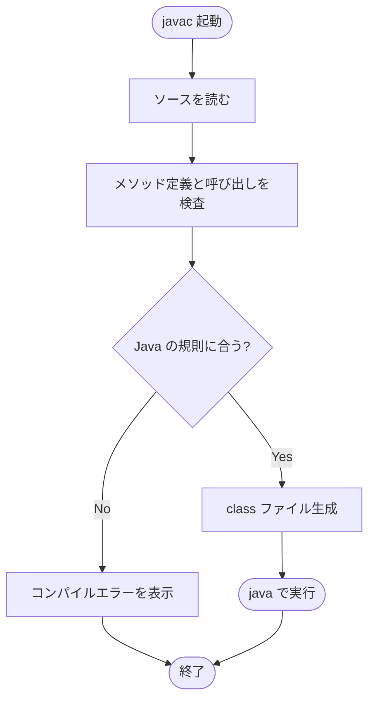

---

# 1. デフォルトパッケージ `src/` のファイル

## Main

- 対象ファイル: `src/Main.java`
- テーマ: 値渡しと参照渡し（基本型 / 配列 / String / 自作クラス）。

### ソースの要点

```java
int[] arrayInt = {10, 20, 30};
foo(arrayInt);   // インスタンス自体を差し替えても呼び出し元は変わらない
foo2(arrayInt);  // 要素を書き換えると呼び出し元の配列にも反映

Person person = new Person();
person.age = 21;
foo(person);     // person変数を差し替えても呼び出し元は変わらない
foo2(person);    // person.age を書き換えると反映
```

### フローチャート

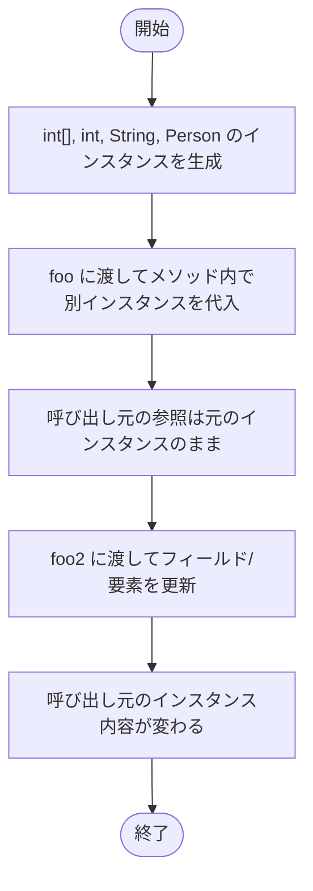

### トレース表

| ステップ | 対象 | メソッド内の操作 | 呼び出し元の見え方 |
|---|---|---|---|
| 1 | `int[] arrayInt` | `abc = new int[]{...}` | 元の `{10,20,30}` のまま |
| 2 | `int[] arrayInt` | `abc[0] = 987` | `arrayInt[0]` が 987 に変わる |
| 3 | `int a` | `a = 444` | 元の 555 のまま |
| 4 | `String aaa` | `aaa = "dasdasadsa"` | 元の `"asasa"` のまま |
| 5 | `Person person` | `person = new Person()` | 元のインスタンスのまま |
| 6 | `Person person` | `person.age = 999` | `person.age` が 999 に変わる |

### 確認ポイント

参照型は「参照（インスタンスの場所）の値渡し」です。仮引数を別インスタンスに付け替えても呼び出し元には影響しません。一方、参照を通じてインスタンスの中身（要素やフィールド）を書き換えると呼び出し元にも反映されます。

---

## Kakunin01

- 対象ファイル: `src/Kakunin01.java`
- テーマ: 識別子と予約語、確認問題。

### ソースの要点

```java
private static void _$() { ... }   // OK
private static void Void() { ... } // OK（Voidは識別子）
private static void 12Test() { ... }    // NG: 数字始まり
private static void static() { ... }    // NG: 予約語
private static void Test#() { ... }     // NG: # は使えない
private static void class() { ... }     // NG: 予約語
```

### フローチャート

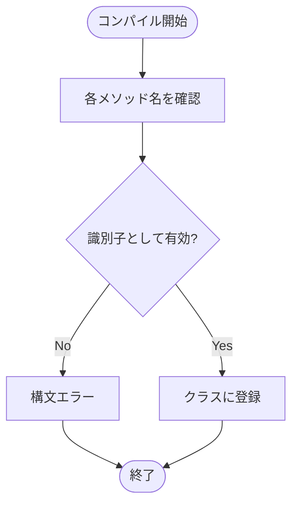

### トレース表

| ステップ | メソッド名 | 判定 | 結果 |
|---|---|---|---|
| 1 | `_$`, `Void`, `MAX`, `TRUE`, `Synchronized` | アンダースコア/ドル/大文字始まりは識別子として有効 | OK |
| 2 | `12Test` | 数字始まり | エラー |
| 3 | `static`, `class`, `native`, `strictfp` | 予約語 | エラー |
| 4 | `Test#` | `#` は識別子文字に含まれない | エラー |

### 確認ポイント

メソッド名は「英字 / アンダースコア / `$` 始まり」かつ「予約語ではない」必要があります。`Void` や `TRUE` は予約語ではないので識別子として使えます（が、可読性のため避けます）。

---

## SampleMethod01a

- 対象ファイル: `src/SampleMethod01a.java`
- テーマ: メソッド未使用の素朴な計算（重複したコードの例）。

### ソースの要点

```java
int price1 = 1200;
int total1 = (int)(price1 + price1 * 0.1);
System.out.println("税込価格 : " + total1 + "円");
int price2 = 1000;
int total2 = (int)(price2 + price2 * 0.1);
System.out.println("税込価格 : " + total2 + "円");
```

### フローチャート

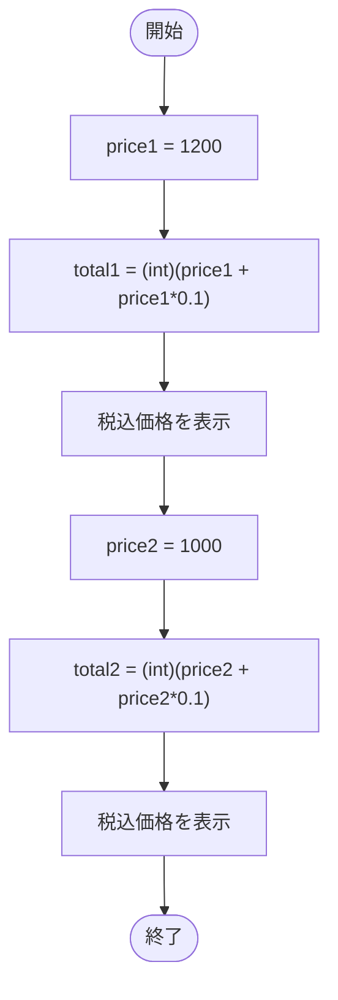

### トレース表

| ステップ | 変数 | 値 | 出力 |
|---|---|---|---|
| 1 | `price1` | 1200 | - |
| 2 | `total1` | 1320 | `税込価格 : 1320円` |
| 3 | `price2` | 1000 | - |
| 4 | `total2` | 1100 | `税込価格 : 1100円` |

### 確認ポイント

同じ計算式が 2 回出てきます。次の `SampleMethod01b` で共通処理をメソッドに切り出します。

---

## SampleMethod01b

- 対象ファイル: `src/SampleMethod01b.java`
- テーマ: 計算をメソッドに切り出す（戻り値あり）。

### ソースの要点

```java
private static int calcTaxedPrice(int price) {
    int total = (int)(price + price * 0.1);
    return total;
}

public static void main(String[] args) {
    int total1 = calcTaxedPrice(1200);
    System.out.println("税込価格 : " + total1 + "円");
    int total2 = calcTaxedPrice(1000);
    System.out.println("税込価格 : " + total2 + "円");
}
```

### フローチャート

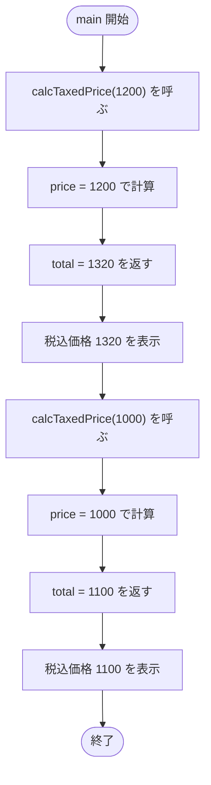

### トレース表

| ステップ | 呼び出し | `price` | 戻り値 | 出力 |
|---|---|---|---|---|
| 1 | `calcTaxedPrice(1200)` | 1200 | 1320 | `税込価格 : 1320円` |
| 2 | `calcTaxedPrice(1000)` | 1000 | 1100 | `税込価格 : 1100円` |

### 確認ポイント

繰り返し使う計算は、引数と戻り値を持つメソッドにまとめると重複が減らせます。

---

## SampleMethod01c

- 対象ファイル: `src/SampleMethod01c.java`
- テーマ: 表示処理もメソッドに切り出す（戻り値なし）。

### ソースの要点

```java
private static void showTaxedPrice(int total) {
    System.out.println("税込価格 : " + total + "円");
}

private static int calcTaxedPrice(int price) {
    return (int)(price + price * 0.1);
}

public static void main(String[] args) {
    int total1 = calcTaxedPrice(1200);
    showTaxedPrice(total1);
    int total2 = calcTaxedPrice(1000);
    showTaxedPrice(total2);
}
```

### フローチャート

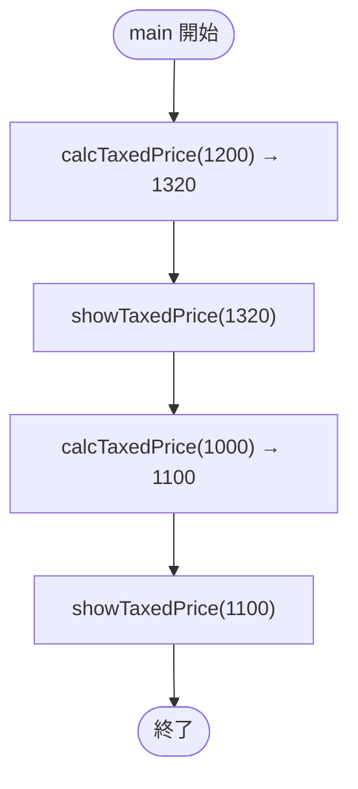

### トレース表

| ステップ | 呼び出し | 戻り値 | 出力 |
|---|---|---|---|
| 1 | `calcTaxedPrice(1200)` | 1320 | - |
| 2 | `showTaxedPrice(1320)` | （void） | `税込価格 : 1320円` |
| 3 | `calcTaxedPrice(1000)` | 1100 | - |
| 4 | `showTaxedPrice(1100)` | （void） | `税込価格 : 1100円` |

### 確認ポイント

「計算する」「表示する」のように責務を分けると、各メソッドが小さく読みやすくなります。

---

## SampleMethodLocal01 (default package)

- 対象ファイル: `src/SampleMethodLocal01.java`
- テーマ: 同名のローカル変数は別物（スコープ）。

### ソースの要点

```java
static void foo() {
    int x = 100; // foo 内の x
}

public static void main(String[] args) {
    int x = 200; // main 内の x（別物）
    foo();
    System.out.println(x); // 200
}
```

### フローチャート

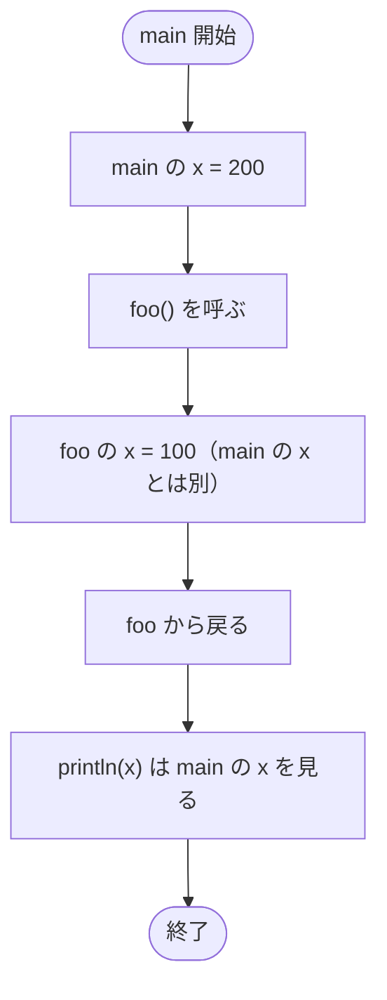

### トレース表

| ステップ | 場所 | `x` の値 | 補足 |
|---|---|---|---|
| 1 | `main` | 200 | 宣言・初期化 |
| 2 | `foo` | 100 | foo 内ローカル |
| 3 | `main` 戻り後 | 200 | 出力は 200 |

### 確認ポイント

同名でも宣言場所が違えば別の変数として扱われます。出力は 200 です。

---

## SampleMethodLocal05 (default package)

- 対象ファイル: `src/SampleMethodLocal05.java`
- テーマ: 配列引数の参照渡し（要素を読む）。

### ソースの要点

```java
static void foo(int[] a) {
    for (int i = 0; i < a.length; i++) {
        System.out.println(a[i]);
    }
}

public static void main(String[] args) {
    int[] a = { 11, 22, 33 };
    foo(a);
}
```

### フローチャート

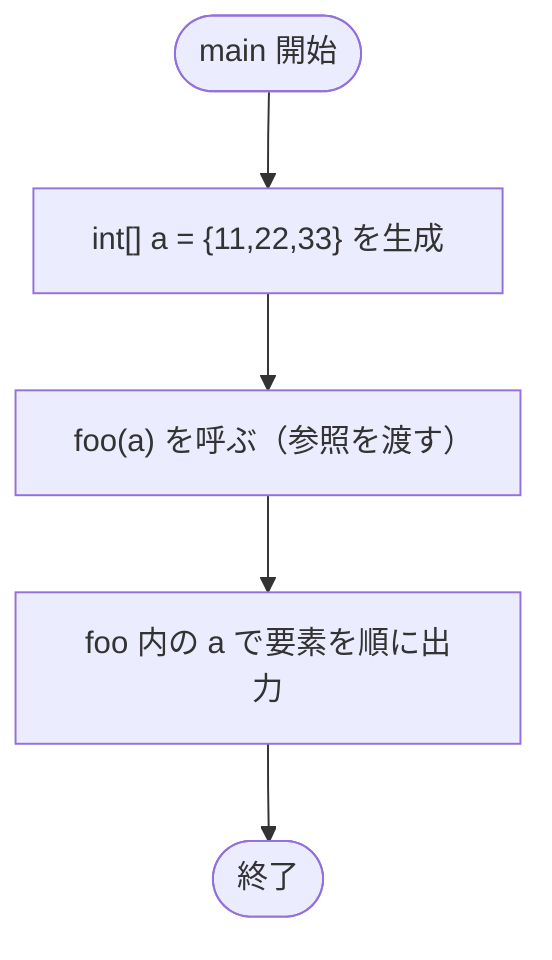

### トレース表

| ステップ | 場所 | `a` | 出力 |
|---|---|---|---|
| 1 | `main` | `{11,22,33}` のインスタンス | - |
| 2 | `foo` 内 | 同じインスタンスを参照 | `11` |
| 3 | `foo` 内 | 〃 | `22` |
| 4 | `foo` 内 | 〃 | `33` |

### 確認ポイント

配列はメソッドに渡しても新しくコピーされません。同じインスタンスを共有して参照します。

---

## SampleMethodLocal06 (default package)

- 対象ファイル: `src/SampleMethodLocal06.java`
- テーマ: 配列を戻り値として返す。

### ソースの要点

```java
static int[] foo() {
    int[] a = { 10, 20, 30 };
    return a;
}

public static void main(String[] args) {
    int[] b = foo();
    for (int i = 0; i < b.length; i++) {
        System.out.println(b[i]);
    }
}
```

### フローチャート

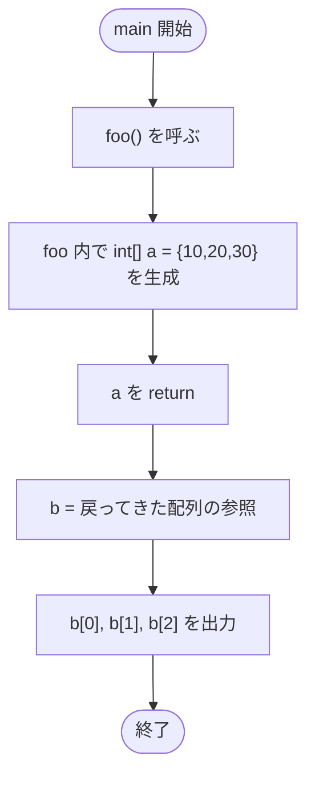

### トレース表

| ステップ | 場所 | 変数 | 値 | 出力 |
|---|---|---|---|---|
| 1 | `foo` | `a` | `{10,20,30}` のインスタンス | - |
| 2 | `main` | `b` | `a` と同じインスタンス | - |
| 3 | `main` | - | - | `10` |
| 4 | `main` | - | - | `20` |
| 5 | `main` | - | - | `30` |

### 確認ポイント

メソッド内で作った配列も `return` で参照を返せます。呼び出し元はそのインスタンスを使い続けられます。

---

## SampleOverload01 (default package)

- 対象ファイル: `src/SampleOverload01.java`
- テーマ: 引数の個数違いによるオーバーロード。

### ソースの要点

```java
static int add(int v, int w) { return v + w; }
static int add(int v, int w, int u) { return v + w + u; }

add(12, 3);
add(12, 3, 4);
```

### フローチャート

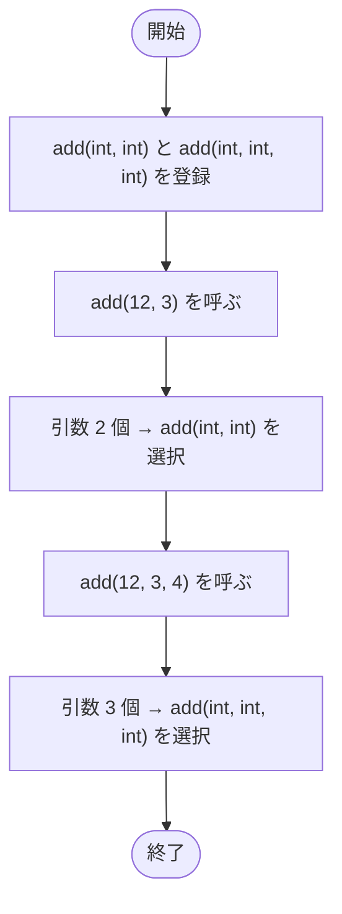

### トレース表

| ステップ | 呼び出し | 選ばれたメソッド | 戻り値 | 出力 |
|---|---|---|---|---|
| 1 | `add(12,3)` | `add(int,int)` | 15 | `2項足すメソッド:` / `x + y = 15` |
| 2 | `add(12,3,4)` | `add(int,int,int)` | 19 | `3項足すメソッド:` / `x + y + z = 19` |

### 確認ポイント

「メソッド名 + 引数の型と数」が違えば、同じ名前の別メソッドとして共存できます（オーバーロード）。

---

## SampleReturn02 (default package)

- 対象ファイル: `src/SampleReturn02.java`
- テーマ: 配列と String を返すメソッド（教材用メッセージ表示）。

### ソースの要点

```java
static int[] foo1() { return new int[]{10,20,30}; }
static String foo2() { return "ABC"; }

public static void main(String[] args) {
    System.out.println("「確認問題：メソッドの呼び出し」を行う時間とします。問題数は19問。");
    System.out.println("足並み揃ったあたりで、解説を行います");
}
```

### フローチャート

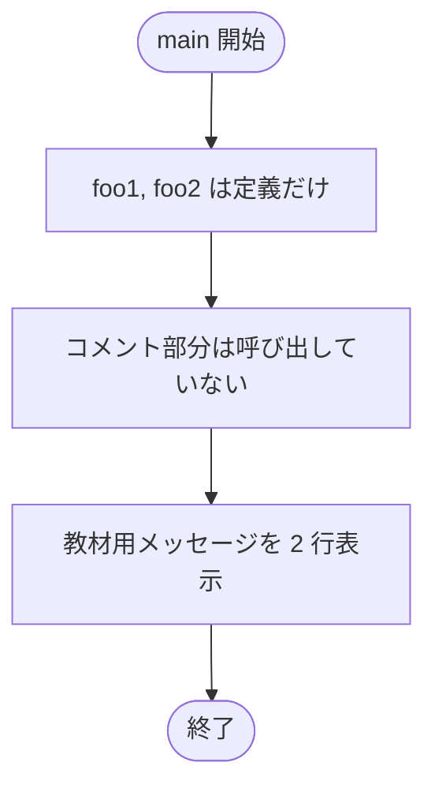

### トレース表

| ステップ | 操作 | 出力 |
|---|---|---|
| 1 | 1 行目を表示 | `「確認問題：メソッドの呼び出し」を行う時間とします。問題数は19問。` |
| 2 | 2 行目を表示 | `足並み揃ったあたりで、解説を行います` |

### 確認ポイント

`foo1`, `foo2` は定義のみで呼び出されていません。コメントを外すと配列インスタンスの `hashCode` や `String` の出力を確認できます。

---

## SignatureSample01

- 対象ファイル: `src/SignatureSample01.java`
- テーマ: 引数の個数が違えばオーバーロードとして区別される。

### ソースの要点

```java
private static int foo(int i, int j, int k, int l) { return 0; }
private static int foo(int i, int j, int k) { return 0; }

foo(1, 2, 3);       // 3 引数版
foo(1, 2, 3, 4);    // 4 引数版
```

### フローチャート

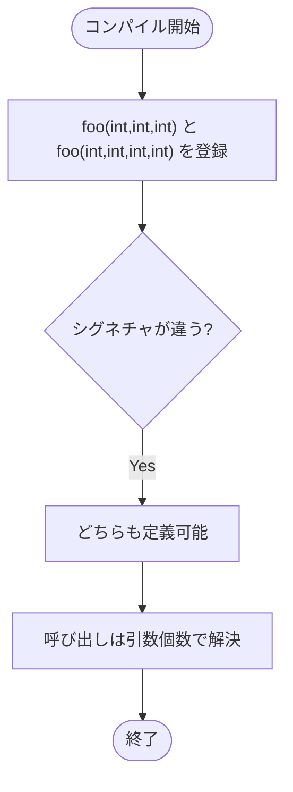

### トレース表

| ステップ | 呼び出し | 一致する定義 | 戻り値 |
|---|---|---|---|
| 1 | `foo(1,2,3)` | `foo(int,int,int)` | 0 |
| 2 | `foo(1,2,3,4)` | `foo(int,int,int,int)` | 0 |

### 確認ポイント

引数の個数が違えば、同じメソッド名でも別シグネチャとして両方とも定義できます。

---

## Test0801 (default package)

- 対象ファイル: `src/Test0801.java`
- テーマ: 基本型の値渡し。

### ソースの要点

```java
static void foo(int x) { x *= 10; }
int x = 1;
foo(x);
System.out.print(x); // 1
```

### フローチャート

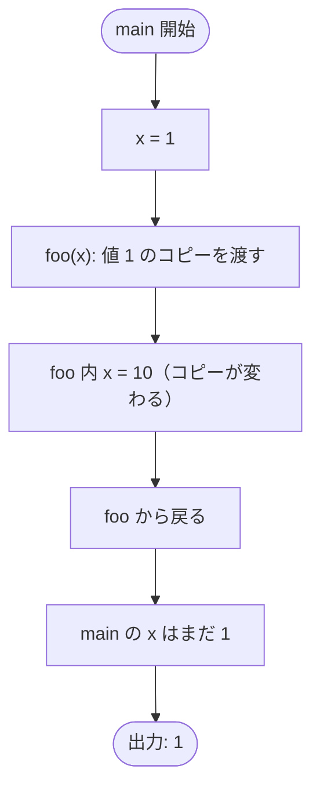

### トレース表

| ステップ | 場所 | `x` | 出力 |
|---|---|---|---|
| 1 | `main` | 1 | - |
| 2 | `foo` 開始時 | 1（コピー） | - |
| 3 | `foo` 内 | 10 | - |
| 4 | `main` 戻り後 | 1 | `1` |

### 確認ポイント

基本型を渡すと「値のコピー」が渡ります。メソッド内で書き換えても呼び出し元には影響しません。

---

## Test0802 (default package)

- 対象ファイル: `src/Test0802.java`
- テーマ: 引数なしのメソッド内のローカル変数は呼び出し元と無関係。

### ソースの要点

```java
static void foo() {
    int x = 777;
    System.out.println(x); // 777
}

int x = 100;
foo();
```

### フローチャート

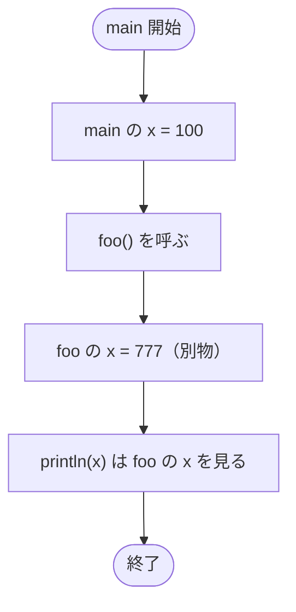

### トレース表

| ステップ | 場所 | `x` | 出力 |
|---|---|---|---|
| 1 | `main` | 100 | - |
| 2 | `foo` | 777 | `777` |

### 確認ポイント

`main` の `x` と `foo` の `x` は完全に別の変数です。

---

## Test0803 (default package)

- 対象ファイル: `src/Test0803.java`
- テーマ: 値渡しの再確認（`x * 100`）。

### ソースの要点

```java
static void foo(int x) { x = x * 100; }
int x = 12;
foo(x);
System.out.println(x); // 12
```

### フローチャート

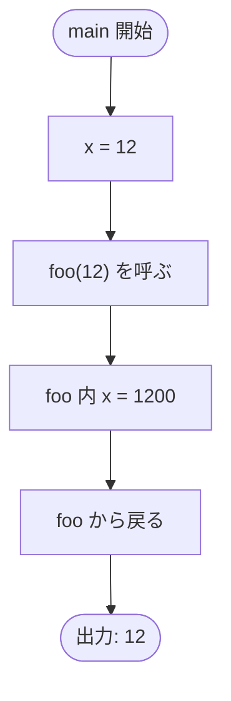

### トレース表

| ステップ | 場所 | `x` | 出力 |
|---|---|---|---|
| 1 | `main` | 12 | - |
| 2 | `foo` 内 | 1200 | - |
| 3 | `main` 戻り後 | 12 | `12` |

### 確認ポイント

基本型は値渡し。`Test0801` と同じ理屈で、`main` 側の `x` は変わりません。

---

## Test0804 (default package)

- 対象ファイル: `src/Test0804.java`
- テーマ: メソッドからメソッドを呼ぶ（戻り値の連鎖）。

### ソースの要点

```java
static int bar(int x) { return x * 2; }
static int foo(int x) {
    x = x * 10;
    return bar(x);
}

int x = 12;
foo(x);                // 戻り値は捨てる
System.out.println(foo(x));
```

### フローチャート

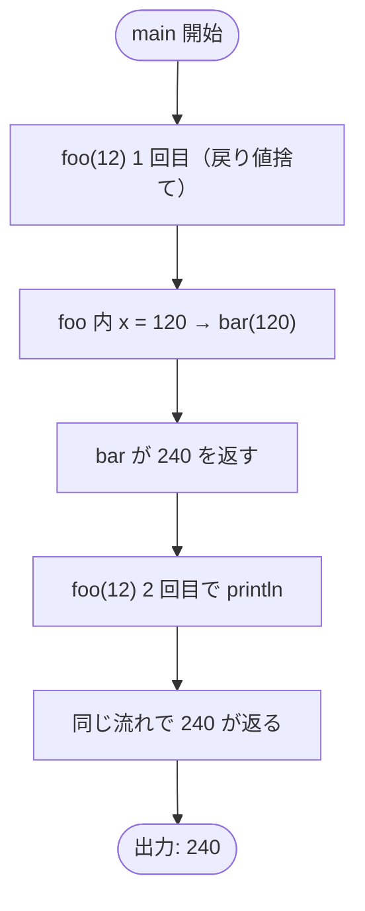

### トレース表

| ステップ | 呼び出し | `foo` 内 `x` | `bar` の戻り値 | 出力 |
|---|---|---|---|---|
| 1 | `foo(12)`（1 回目） | 120 | 240 | - |
| 2 | `foo(12)`（2 回目） | 120 | 240 | `240` |

### 確認ポイント

戻り値はそのまま `println` の引数や別メソッドの引数に渡せます。同じ呼び出しは独立に評価されます。

---

## Test0805 (default package)

- 対象ファイル: `src/Test0805.java`
- テーマ: メソッド呼び出し順と出力順。

### ソースの要点

```java
static void bar() { System.out.println("A"); }
static void foo() {
    bar();
    System.out.println("B");
}

foo();
bar();
```

### フローチャート

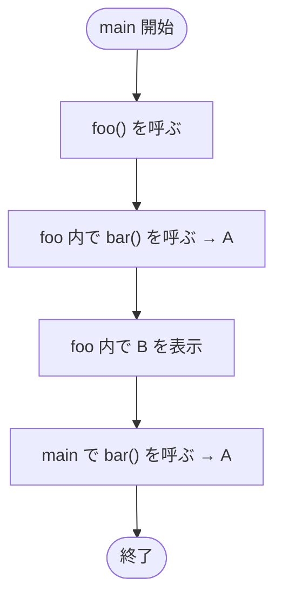

### トレース表

| ステップ | 場所 | 出力 |
|---|---|---|
| 1 | `bar` (foo 経由) | `A` |
| 2 | `foo` | `B` |
| 3 | `bar` (main 直接) | `A` |

### 確認ポイント

出力は `A` `B` `A` の順。メソッドは呼ばれた場所で順に評価されます。

---

## Test0806 (default package)

- 対象ファイル: `src/Test0806.java`
- テーマ: メソッド呼び出しと戻り値の組み合わせ。

### ソースの要点

```java
static int bar(int x) { return 2 + x; }
static int foo() {
    int x = 1;
    int y;
    y = bar(x); // 3
    x = x + 1;
    return y;
}

int foo = foo();    // 3
int bar = bar(1);   // 3
System.out.println(foo + bar); // 6
```

### フローチャート

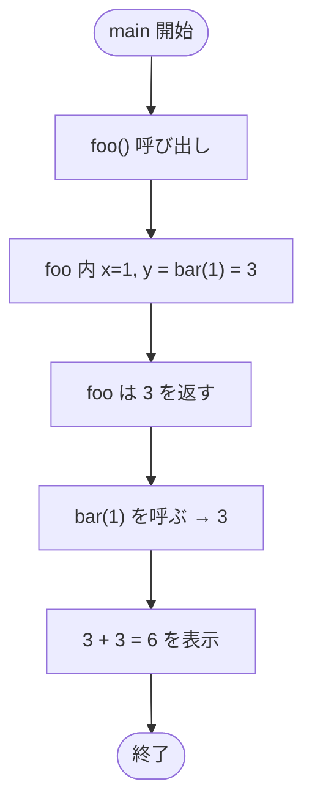

### トレース表

| ステップ | 呼び出し | 戻り値 | 出力 |
|---|---|---|---|
| 1 | `foo()` | 3 | - |
| 2 | `bar(1)` | 3 | - |
| 3 | `println(foo+bar)` | - | `6` |

### 確認ポイント

ローカル変数名がメソッド名と同じ `foo`, `bar` でも問題なく動きます（識別はコンパイラがします）。

---

## Test0807 (default package)

- 対象ファイル: `src/Test0807.java`
- テーマ: `static` メソッド同士の呼び出し（このバージョンは正常）。

### ソースの要点

```java
static int bar(int x) { return 2 + x; }
static int foo() {
    int x = 5;
    x = bar(x); // 7
    return x;
}
System.out.println(foo()); // 7
```

### フローチャート

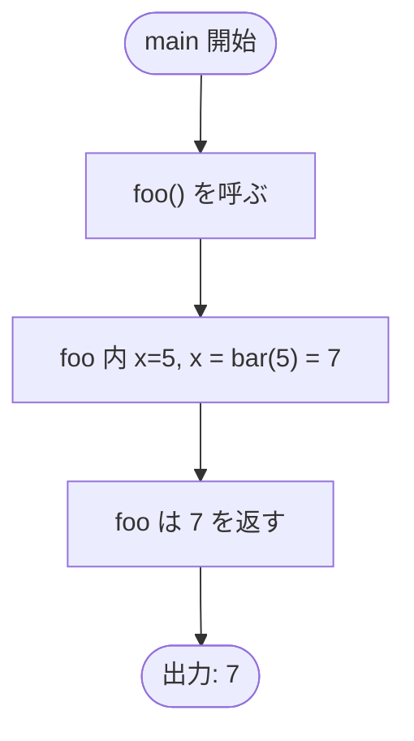

### トレース表

| ステップ | 場所 | `x` | 戻り値 | 出力 |
|---|---|---|---|---|
| 1 | `foo` | 5 → 7 | 7 | - |
| 2 | `main` | - | - | `7` |

### 確認ポイント

`static` メソッド同士は、インスタンスなしで直接呼び合えます。 `vol08_2/Test0807` の `static` 抜きケースと比較してください。

---

## Test0808 (default package)

- 対象ファイル: `src/Test0808.java`
- テーマ: メソッドの戻り値を別メソッドの引数にする。

### ソースの要点

```java
static int bar(int x) { return 2 * x; }
static int foo(int x) { return x + 1; }

int foo = foo(1);     // 2
int bar = bar(foo);   // 4
System.out.println(bar); // 4
```

### フローチャート

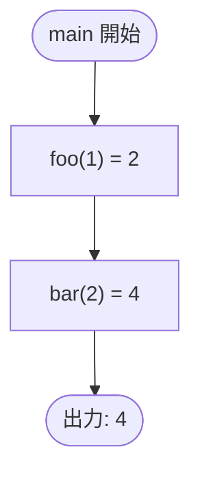

### トレース表

| ステップ | 呼び出し | 戻り値 |
|---|---|---|
| 1 | `foo(1)` | 2 |
| 2 | `bar(2)` | 4 |
| 3 | `println(4)` | - |

### 確認ポイント

`bar(foo(1))` のように直接ネストもできますが、変数に入れて分解すると読みやすくなります。

---

## Test0809 (default package)

- 対象ファイル: `src/Test0809.java`
- テーマ: 戻り値での拡大変換（`int` → `double`）。

### ソースの要点

```java
static double bar(int x) {
    return x; // int → double に自動拡大
}
double d = bar(7);
System.out.println(d); // 7.0
```

### フローチャート

```mermaid
flowchart TD
    A([開始]) --> B["bar(7) を呼ぶ"]
    B --> C["x = 7（int）"]
    C --> D["return x は double に拡大変換"]
    D --> E["d = 7.0"]
    E --> F([出力: 7.0])
```

### トレース表

| ステップ | 値 | 型 | 出力 |
|---|---|---|---|
| 1 | 7 | `int` | - |
| 2 | 7.0 | `double` | - |
| 3 | - | - | `7.0` |

### 確認ポイント

戻り値型の方が広い型なら、`return` 時に自動で拡大変換されます。

---

## Test0810 (default package)

- 対象ファイル: `src/Test0810.java`
- テーマ: 引数の縮小変換にはキャストが必要（このバージョンは `(char)` 付きで正常）。

### ソースの要点

```java
static int bar(char x) { return x; }
int x = 65;
x = bar((char) x);
System.out.println(x); // 65
```

### フローチャート

```mermaid
flowchart TD
    A([開始]) --> B["int x = 65"]
    B --> C["(char) x で 'A' に変換"]
    C --> D["bar('A') を呼ぶ"]
    D --> E["return x は char → int に拡大"]
    E --> F([出力: 65])
```

### トレース表

| ステップ | 場所 | 値 | 型 |
|---|---|---|---|
| 1 | `main` | 65 | `int` |
| 2 | `bar` 引数 | `'A'` (= 65) | `char` |
| 3 | `bar` 戻り値 | 65 | `int` |
| 4 | `main` 出力 | `65` | - |

### 確認ポイント

`int` → `char` は縮小変換なので、`(char)` を明示的に書きます。 `vol08_2/Test0810` ではキャストがなく、コンパイルエラーになります。

---

## Test0811 (default package)

- 対象ファイル: `src/Test0811.java`
- テーマ: 引数の拡大変換（`long` → `float`）。

### ソースの要点

```java
static void bar(float x) { System.out.println(x); }
long x = 10;
bar(x); // 自動拡大
```

### フローチャート

```mermaid
flowchart TD
    A([開始]) --> B["long x = 10"]
    B --> C["bar(x): long → float へ自動拡大"]
    C --> D["bar 内で x = 10.0f"]
    D --> E([出力: 10.0])
```

### トレース表

| ステップ | 値 | 型 | 出力 |
|---|---|---|---|
| 1 | 10 | `long` | - |
| 2 | 10.0 | `float` | `10.0` |

### 確認ポイント

`long` → `float` は精度低下の可能性がありますが、Java では拡大変換として暗黙に許可されます。

---

## Test0812 (default package)

- 対象ファイル: `src/Test0812.java`
- テーマ: 引数なしの正しい書き方（こちらは正常版）。

### ソースの要点

```java
static void foo() { System.out.print("A"); }
static void bar(short x) {
    foo();
    System.out.println("B");
}
short s = 1;
foo();
bar(s);
```

### フローチャート

```mermaid
flowchart TD
    A([main 開始]) --> B["foo() を呼ぶ → A"]
    B --> C["bar(1) を呼ぶ"]
    C --> D["bar 内 foo() → A"]
    D --> E["bar 内 B を表示"]
    E --> F([終了])
```

### トレース表

| ステップ | 場所 | 出力 |
|---|---|---|
| 1 | `foo` (main 直接) | `A` |
| 2 | `foo` (bar 経由) | `A` |
| 3 | `bar` | `B` |

### 確認ポイント

引数なしは `foo()` と空の `()` で書きます。 `vol08_2/Test0812` の `foo(void)` という誤記とは別物です。

---

## Test0813 (default package)

- 対象ファイル: `src/Test0813.java`
- テーマ: `byte` 戻り値と複合代入。

### ソースの要点

```java
static byte foo() {
    byte b = 1;
    b += 1;   // b = (byte)(b + 1) と等価。複合代入は自動でキャスト
    return b; // 2
}
System.out.print(foo()); // 2
```

### フローチャート

```mermaid
flowchart TD
    A([開始]) --> B["foo() を呼ぶ"]
    B --> C["b = 1"]
    C --> D["b += 1 は (byte)(b+1) と同じ"]
    D --> E["b = 2 を return"]
    E --> F([出力: 2])
```

### トレース表

| ステップ | `b` | 出力 |
|---|---|---|
| 1 | 1 | - |
| 2 | 2 | - |
| 3 | - | `2` |

### 確認ポイント

`b += 1` は自動キャストされるので `byte` のままです。 `b = b + 1` はそのままでは `int` になるためコンパイルエラーになります。

---

## Test0814 (default package)

- 対象ファイル: `src/Test0814.java`
- テーマ: 配列引数と要素の初期値。

### ソースの要点

```java
static void foo(int[] a) {
    for (int x : a) System.out.println(x);
}

int[] a = new int[3];
for (int i = 0; i < a.length; i++) a[i] = a[i] + 10;
foo(a);
```

### フローチャート

```mermaid
flowchart TD
    A([開始]) --> B["int[3] を生成（初期値 0）"]
    B --> C["全要素に +10 → {10,10,10}"]
    C --> D["foo(a) を呼び、各要素を出力"]
    D --> E([終了])
```

### トレース表

| ステップ | `a` の中身 | 出力 |
|---|---|---|
| 1 | `{0,0,0}` | - |
| 2 | `{10,10,10}` | - |
| 3 | `foo` 1 周目 | `10` |
| 4 | 〃 2 周目 | `10` |
| 5 | 〃 3 周目 | `10` |

### 確認ポイント

`new int[3]` は要素 0 で初期化されます。

---

## Test0815 (default package)

- 対象ファイル: `src/Test0815.java`
- テーマ: 配列の参照渡し（要素を書き換えると呼び出し元に反映）。

### ソースの要点

```java
static void foo(int[] a) { a[1] = 100; }
int[] a = { 1, 2, 3, 4 };
foo(a);
for (int i = 0; i < 4; i++) System.out.print(a[i] + ":");
```

### フローチャート

```mermaid
flowchart TD
    A([開始]) --> B["{1,2,3,4} を生成"]
    B --> C["foo(a): a[1] = 100"]
    C --> D["main 側の a も {1,100,3,4}"]
    D --> E([出力: 1:100:3:4:])
```

### トレース表

| ステップ | `a` | 出力 |
|---|---|---|
| 1 | `{1,2,3,4}` | - |
| 2 | `{1,100,3,4}` | - |
| 3 | - | `1:100:3:4:` |

### 確認ポイント

`foo` 内の `a` と `main` の `a` は同じインスタンスを参照しています。

---

## Test0816 (default package)

- 対象ファイル: `src/Test0816.java`
- テーマ: 仮引数と実引数の順序（名前ではなく位置で対応）。

### ソースの要点

```java
static long foo(int x, int y, int v, int w) { return x*y + v + w; }
int x=2, y=3, v=1, w=0;
foo(v, w, x, y); // 仮引数 (x,y,v,w) = (1,0,2,3)
```

### フローチャート

```mermaid
flowchart TD
    A([開始]) --> B["main: x=2,y=3,v=1,w=0"]
    B --> C["foo(v,w,x,y) で渡す"]
    C --> D["foo 仮引数: x=1, y=0, v=2, w=3"]
    D --> E["x*y + v + w = 0 + 2 + 3 = 5"]
    E --> F([出力: 5])
```

### トレース表

| ステップ | 仮引数 | 値 |
|---|---|---|
| 1 | `x` | 1 |
| 2 | `y` | 0 |
| 3 | `v` | 2 |
| 4 | `w` | 3 |
| 5 | 戻り値 | 5 |

### 確認ポイント

引数は宣言の「位置」で対応します。名前が同じだから対応するわけではありません。

---

## Test0817 (default package)

- 対象ファイル: `src/Test0817.java`
- テーマ: `void` メソッドでの `return` 省略。

### ソースの要点

```java
static void foo() {
    int x = 0;
    System.out.println(x);
    // return; は省略可
}
for (int i = 0; i < 3; i++) foo();
```

### フローチャート

```mermaid
flowchart TD
    A([開始]) --> B{"i < 3 ?"}
    B -- Yes --> C["foo() を呼ぶ → 0"]
    C --> D["i++"]
    D --> B
    B -- No --> E([終了])
```

### トレース表

| ステップ | `i` | 出力 |
|---|---|---|
| 1 | 0 | `0` |
| 2 | 1 | `0` |
| 3 | 2 | `0` |

### 確認ポイント

`void` メソッドでは `return;` を省略できます。

---

## Test0818 (default package)

- 対象ファイル: `src/Test0818.java`
- テーマ: 引数の個数不一致（コンパイルエラー教材）。

### ソースの要点

```java
static void foo(short s) { System.out.println(s); }
foo(); // ← short 引数がないのでエラー
```

### フローチャート

```mermaid
flowchart TD
    A([コンパイル開始]) --> B["foo(short) を確認"]
    B --> C["foo() を確認"]
    C --> D{"short 引数は渡されている?"}
    D -- No --> E["実引数リスト不一致 → エラー"]
    E --> F([終了])
```

### トレース表

| ステップ | 呼び出し | 必要な引数 | 結果 |
|---|---|---|---|
| 1 | `foo(short)` | `short` 1 個 | 定義は有効 |
| 2 | `foo()` | 0 個 | 個数不一致 |
| 3 | コンパイル | - | エラー |

### 確認ポイント

メソッド呼び出しでは、仮引数と同じ数・互換型の実引数を渡す必要があります。

---

## Test0819 (default package)

- 対象ファイル: `src/Test0819.java`
- テーマ: `if/else` でメソッドを使い分け（コメントアウトされた三項演算子と等価）。

### ソースの要点

```java
static int foo1() { return 10; }
static int foo2() { return -20; }

int x = 1, y = 2;
int z;
if (x > y) z = foo1(); else z = foo2();
System.out.print(z); // -20
```

### フローチャート

```mermaid
flowchart TD
    A([開始]) --> B["x=1, y=2"]
    B --> C{"x > y ?"}
    C -- No --> D["z = foo2() = -20"]
    C -- Yes --> E["z = foo1() = 10"]
    D --> F([出力: -20])
    E --> F
```

### トレース表

| ステップ | 条件 | 呼ばれるメソッド | `z` |
|---|---|---|---|
| 1 | `1 > 2`（偽） | `foo2()` | -20 |

### 確認ポイント

`(x > y) ? foo1() : foo2()` という三項演算子でも同じ結果になります。

---

# 2. パッケージ `vol08_2` のファイル

## vol08_2/App

- 対象ファイル: `src/vol08_2/App.java`
- テーマ: パッケージ単位の動作確認用エントリ。

### ソースの要点

```java
package vol08_2;
public class App {
    public static void main(String[] args) throws Exception {
        System.out.println("Hello, World!");
    }
}
```

### フローチャート

```mermaid
flowchart TD
    A([main 開始]) --> B["Hello, World! を表示"]
    B --> C([終了])
```

### トレース表

| ステップ | 操作 | 出力 |
|---|---|---|
| 1 | 文字列を出力 | `Hello, World!` |

### 確認ポイント

`vol08_2` パッケージが正しくコンパイル・実行できるかの最小動作確認です。

---

## vol08_2/SampleArg01

- 対象ファイル: `src/vol08_2/SampleArg01.java`
- テーマ: 引数の拡大変換（`byte`/`short`/`char` → `int`）。

### ソースの要点

```java
static void meth(int x) { System.out.println(x); }

byte b = 10;   meth(b);
short s = 54;  meth(s);
int i = 400;   meth(i);
char c = 'A';  meth(c);
```

### フローチャート

```mermaid
flowchart TD
    A([開始]) --> B["meth(b): byte → int に拡大"]
    B --> C["meth(s): short → int に拡大"]
    C --> D["meth(i): int そのまま"]
    D --> E["meth(c): char → int に拡大（'A'=65）"]
    E --> F([終了])
```

### トレース表

| ステップ | 実引数の型 | 値 | 拡大後 | 出力 |
|---|---|---|---|---|
| 1 | `byte` | 10 | 10 | `10` |
| 2 | `short` | 54 | 54 | `54` |
| 3 | `int` | 400 | 400 | `400` |
| 4 | `char` | `'A'` | 65 | `65` |

### 確認ポイント

`int` より小さい整数型と `char` は、暗黙の拡大変換で `int` 引数に渡せます。

---

## vol08_2/SampleArg02

- 対象ファイル: `src/vol08_2/SampleArg02.java`
- テーマ: 引数の縮小変換は明示キャストが必要。

### ソースの要点

```java
static void meth(int x) { System.out.println(x); }
long l = 20L;     meth((int) l);
float f = 2.3F;   meth((int) f);
double d = 3.4;   meth((int) d);
```

### フローチャート

```mermaid
flowchart TD
    A([開始]) --> B["(int) l = 20"]
    B --> C["(int) f = 2"]
    C --> D["(int) d = 3"]
    D --> E([終了])
```

### トレース表

| ステップ | 元の型 | 値 | キャスト後 | 出力 |
|---|---|---|---|---|
| 1 | `long` | 20 | 20 | `20` |
| 2 | `float` | 2.3 | 2 | `2` |
| 3 | `double` | 3.4 | 3 | `3` |

### 確認ポイント

`int` より広い型から `int` への変換は、`(int)` を書いて明示します。小数部は切り捨てられます。

---

## vol08_2/SampleArg03

- 対象ファイル: `src/vol08_2/SampleArg03.java`
- テーマ: 縮小変換の暗黙化は不可（コンパイルエラー教材）。

### ソースの要点

```java
static void meth(int x) { ... }
double d = 3.4;
meth(d); // double → int は暗黙にできない
```

### フローチャート

```mermaid
flowchart TD
    A([コンパイル開始]) --> B["meth(int) を確認"]
    B --> C["meth(d) を確認"]
    C --> D{"double を int へ暗黙変換できる?"}
    D -- No --> E([コンパイルエラー])
```

### トレース表

| ステップ | 対象 | 判定 |
|---|---|---|
| 1 | `meth(int)` | 定義は有効 |
| 2 | `meth(d)` | `d` は `double` |
| 3 | 変換 | 暗黙不可 → エラー |

### 確認ポイント

`meth((int) d)` のように明示的なキャストが必要です。

---

## vol08_2/SampleCall01

- 対象ファイル: `src/vol08_2/SampleCall01.java`
- テーマ: 戻り値を文字列連結で表示。

### ソースの要点

```java
static int add(int v, int w) { return v + w; }
int x = 12, y = 3;
System.out.println("x + y = " + add(x, y));
```

### フローチャート

```mermaid
flowchart TD
    A([開始]) --> B["add(12, 3) = 15"]
    B --> C["文字列連結: \"x + y = \" + 15"]
    C --> D([出力: x + y = 15])
```

### トレース表

| ステップ | 呼び出し | 戻り値 | 出力 |
|---|---|---|---|
| 1 | `add(12,3)` | 15 | - |
| 2 | `println` | - | `x + y = 15` |

### 確認ポイント

戻り値は式の一部としてそのまま使えます。

---

## vol08_2/SampleCall02

- 対象ファイル: `src/vol08_2/SampleCall02.java`
- テーマ: 戻り値なし（`void`）のメソッドを呼ぶ。

### ソースの要点

```java
static void add(int v, int w) {
    System.out.println("x + y = " + (v + w));
}
add(12, 3);
```

### フローチャート

```mermaid
flowchart TD
    A([開始]) --> B["add(12,3) を呼ぶ"]
    B --> C["add 内で 15 を表示"]
    C --> D([終了])
```

### トレース表

| ステップ | 呼び出し | 出力 |
|---|---|---|
| 1 | `add(12,3)` | `x + y = 15` |

### 確認ポイント

`void` のメソッドは「処理だけ」を実行し、値を返しません。

---

## vol08_2/SampleCall03

- 対象ファイル: `src/vol08_2/SampleCall03.java`
- テーマ: 引数なしのメソッド呼び出し。

### ソースの要点

```java
static void showMessage() { System.out.println("Hello!"); }
showMessage();
```

### フローチャート

```mermaid
flowchart TD
    A([開始]) --> B["showMessage() を呼ぶ"]
    B --> C([出力: Hello!])
```

### トレース表

| ステップ | 呼び出し | 出力 |
|---|---|---|
| 1 | `showMessage()` | `Hello!` |

### 確認ポイント

引数も戻り値もないメソッドは「ただ呼ぶだけ」で動きます。

---

## vol08_2/SampleCall04

- 対象ファイル: `src/vol08_2/SampleCall04.java`
- テーマ: 配列を引数で渡して読む。

### ソースの要点

```java
static void printArray(int[] a) {
    for (int n : a) System.out.println(n);
}
int[] array = {10, 20, 30};
printArray(array);
```

### フローチャート

```mermaid
flowchart TD
    A([開始]) --> B["int[] array = {10,20,30}"]
    B --> C["printArray(array)"]
    C --> D["拡張 for で 10,20,30 を順に出力"]
    D --> E([終了])
```

### トレース表

| ステップ | `n` | 出力 |
|---|---|---|
| 1 | 10 | `10` |
| 2 | 20 | `20` |
| 3 | 30 | `30` |

### 確認ポイント

`for-each` は要素の値を順に取り出します。配列インスタンスは参照で渡ります。

---

## vol08_2/SampleCall05

- 対象ファイル: `src/vol08_2/SampleCall05.java`
- テーマ: 配列の要素を書き換える（参照渡し）。

### ソースの要点

```java
static void meth(int[] a) { a[0] = 1000; }
int[] array = {10, 20, 30};
meth(array);
for (int n : array) System.out.println(n);
```

### フローチャート

```mermaid
flowchart TD
    A([開始]) --> B["array = {10,20,30}"]
    B --> C["meth(array): a[0] = 1000"]
    C --> D["array = {1000,20,30}"]
    D --> E["全要素を出力"]
    E --> F([終了])
```

### トレース表

| ステップ | `array` | 出力 |
|---|---|---|
| 1 | `{10,20,30}` | - |
| 2 | `{1000,20,30}` | - |
| 3 | - | `1000` |
| 4 | - | `20` |
| 5 | - | `30` |

### 確認ポイント

配列の要素を変更すると呼び出し元にも反映されます。

---

## vol08_2/SampleCall06

- 対象ファイル: `src/vol08_2/SampleCall06.java`
- テーマ: 配列を戻り値で受け取る。

### ソースの要点

```java
static int[] createArray() {
    int[] a = {10, 20, 30};
    return a;
}
int[] b = createArray();
for (int i = 0; i < b.length; i++) System.out.println(b[i]);
```

### フローチャート

```mermaid
flowchart TD
    A([開始]) --> B["createArray() を呼ぶ"]
    B --> C["内部で {10,20,30} を生成して return"]
    C --> D["b にその参照を代入"]
    D --> E["b[0], b[1], b[2] を出力"]
    E --> F([終了])
```

### トレース表

| ステップ | `b[i]` | 出力 |
|---|---|---|
| 1 | `b[0]` | `10` |
| 2 | `b[1]` | `20` |
| 3 | `b[2]` | `30` |

### 確認ポイント

メソッド内で生成した配列も `return` で返せば、呼び出し元で使い続けられます。

---

## vol08_2/SampleMethodLocal01

- 対象ファイル: `src/vol08_2/SampleMethodLocal01.java`
- テーマ: ローカル変数のスコープ（コンパイルエラー教材）。

### ソースの要点

```java
static void foo() { int x = 100; }
public static void main(String[] args) {
    foo();
    System.out.println(x); // ← main に x はない
}
```

### フローチャート

```mermaid
flowchart TD
    A([コンパイル開始]) --> B["foo 内で x を宣言"]
    B --> C["main 内で x を参照"]
    C --> D{"x は main のスコープ?"}
    D -- No --> E["シンボルが見つからない → エラー"]
```

### トレース表

| ステップ | 場所 | `x` |
|---|---|---|
| 1 | `foo` | 宣言される（foo の中だけ有効） |
| 2 | `main` | 宣言されていない |
| 3 | `println(x)` | シンボルなし → エラー |

### 確認ポイント

メソッド内のローカル変数は、そのメソッドの外からは参照できません。

---

## vol08_2/SampleMethodLocal02

- 対象ファイル: `src/vol08_2/SampleMethodLocal02.java`
- テーマ: 仮引数の値表示。

### ソースの要点

```java
static void foo(int x) { System.out.println(x); }
int x = 12;
foo(x); // 12
```

### フローチャート

```mermaid
flowchart TD
    A([開始]) --> B["main の x = 12"]
    B --> C["foo(12) を呼ぶ"]
    C --> D["foo 内 x = 12 を出力"]
    D --> E([終了])
```

### トレース表

| ステップ | 場所 | `x` | 出力 |
|---|---|---|---|
| 1 | `main` | 12 | - |
| 2 | `foo` | 12（コピー） | `12` |

### 確認ポイント

仮引数も「メソッドの中だけのローカル変数」です。

---

## vol08_2/SampleMethodLocal03

- 対象ファイル: `src/vol08_2/SampleMethodLocal03.java`
- テーマ: 値渡しでの書き換えは呼び出し元に影響しない（出力なし）。

### ソースの要点

```java
static void foo(int x) { x = x * 10; }
int x = 12;
foo(x);
System.out.println(x); // 12
```

### フローチャート

```mermaid
flowchart TD
    A([開始]) --> B["main の x = 12"]
    B --> C["foo(12): 内部で x = 120"]
    C --> D["foo 戻り後、main の x は 12 のまま"]
    D --> E([出力: 12])
```

### トレース表

| ステップ | 場所 | `x` | 出力 |
|---|---|---|---|
| 1 | `main` | 12 | - |
| 2 | `foo` 内 | 120 | - |
| 3 | `main` | 12 | `12` |

### 確認ポイント

基本型は値渡し。 `Test0801` と同じ確認ができます。

---

## vol08_2/SampleMethodLocal04

- 対象ファイル: `src/vol08_2/SampleMethodLocal04.java`
- テーマ: 戻り値で間接的に値を取り出す。

### ソースの要点

```java
static int foo(int x) {
    x = x * 10;
    System.out.println(x);
    return x;
}
int x = 7;
System.out.println(foo(x)); // 70 を 2 回（内部出力 + 戻り値出力）
System.out.println(x);      // 7
```

### フローチャート

```mermaid
flowchart TD
    A([開始]) --> B["foo(7) を呼ぶ"]
    B --> C["foo 内 x=70 を出力"]
    C --> D["return 70"]
    D --> E["main 側で 70 を出力"]
    E --> F["main の x は 7 を出力"]
    F --> G([終了])
```

### トレース表

| ステップ | 場所 | `x` | 出力 |
|---|---|---|---|
| 1 | `foo` 内 | 70 | `70` |
| 2 | `main` | - | `70` |
| 3 | `main` | 7 | `7` |

### 確認ポイント

呼び出し元と仮引数は別の変数。戻り値で値を「受け取り直す」必要があります。

---

## vol08_2/SampleMethodLocal05

- 対象ファイル: `src/vol08_2/SampleMethodLocal05.java`
- テーマ: 配列引数で全要素を出力（参照渡し）。

### ソースの要点

```java
static void foo(int[] a) {
    for (int i = 0; i < a.length; i++) System.out.println(a[i]);
}
int[] a = { 11, 22, 33 };
foo(a);
```

### フローチャート

```mermaid
flowchart TD
    A([開始]) --> B["{11,22,33} を生成"]
    B --> C["foo(a) を呼ぶ"]
    C --> D["要素を順に出力"]
    D --> E([終了])
```

### トレース表

| ステップ | `i` | `a[i]` | 出力 |
|---|---|---|---|
| 1 | 0 | 11 | `11` |
| 2 | 1 | 22 | `22` |
| 3 | 2 | 33 | `33` |

### 確認ポイント

配列インスタンスは `foo` と `main` で共有されます（参照渡し）。

---

## vol08_2/SampleMethodLocal06

- 対象ファイル: `src/vol08_2/SampleMethodLocal06.java`
- テーマ: 配列の生成と戻り値。

### ソースの要点

```java
static int[] foo() {
    int[] a = {10, 20, 30};
    return a;
}
int[] b = foo();
for (int i = 0; i < b.length; i++) System.out.println(b[i]);
```

### フローチャート

```mermaid
flowchart TD
    A([開始]) --> B["foo(): 配列を生成して return"]
    B --> C["b にその参照を代入"]
    C --> D["b[0..2] を出力"]
    D --> E([終了])
```

### トレース表

| ステップ | `b[i]` | 出力 |
|---|---|---|
| 1 | 10 | `10` |
| 2 | 20 | `20` |
| 3 | 30 | `30` |

### 確認ポイント

`SampleCall06` と同じパターンで、配列を戻り値で受け取れます。

---

## vol08_2/SampleOverload01

- 対象ファイル: `src/vol08_2/SampleOverload01.java`
- テーマ: 引数の個数違いのオーバーロード（パッケージ版）。

### ソースの要点

```java
static int add(int v, int w) { return v + w; }
static int add(int v, int w, int u) { return v + w + u; }

add(12, 3);     // 15
add(12, 3, 4);  // 19
```

### フローチャート

```mermaid
flowchart TD
    A([開始]) --> B["add(12,3) → add(int,int)"]
    B --> C["15 を表示"]
    C --> D["add(12,3,4) → add(int,int,int)"]
    D --> E([19 を表示])
```

### トレース表

| 呼び出し | 戻り値 | 出力 |
|---|---|---|
| `add(12,3)` | 15 | `2項足すメソッド:` / `x + y = 15` |
| `add(12,3,4)` | 19 | `3項足すメソッド:` / `x + y + z = 19` |

### 確認ポイント

`src/SampleOverload01.java` と同じ内容のパッケージ版です。

---

## vol08_2/SampleOverload02

- 対象ファイル: `src/vol08_2/SampleOverload02.java`
- テーマ: 引数名だけ違うのは重複（コンパイルエラー教材）。

### ソースの要点

```java
static int add(int v, int w) { return v + w; }
static int add(int a, int b) { return a + b; } // ← 重複
```

### フローチャート

```mermaid
flowchart TD
    A([コンパイル開始]) --> B["1 つ目 add(int,int) を登録"]
    B --> C["2 つ目 add(int,int) を確認"]
    C --> D{"シグネチャは違う?"}
    D -- No --> E["重複定義エラー"]
```

### トレース表

| ステップ | シグネチャ | 結果 |
|---|---|---|
| 1 | `add(int,int)` | 登録 |
| 2 | `add(int,int)` | 重複 → エラー |

### 確認ポイント

シグネチャは「メソッド名 + 引数の型と順序」。引数名だけを変えても別メソッドにはなりません。

---

## vol08_2/SampleReturn01

- 対象ファイル: `src/vol08_2/SampleReturn01.java`
- テーマ: 戻り値の拡大変換（`short`/`byte`/`char` → `int`）。

### ソースの要点

```java
static int foo1() { int x = 1; return x; }
static int foo2() { short x = 2; return x; }
static int foo3() { byte x = 3; return x; }
static int foo4() { char x = 'A'; return x; }
```

### フローチャート

```mermaid
flowchart TD
    A([開始]) --> B["foo1() → 1"]
    B --> C["foo2() → 2（short→int 拡大）"]
    C --> D["foo3() → 3（byte→int 拡大）"]
    D --> E["foo4() → 65（char→int 拡大）"]
    E --> F([終了])
```

### トレース表

| ステップ | 戻り値の元の型 | 値 | 拡大後 | 出力 |
|---|---|---|---|---|
| 1 | `int` | 1 | 1 | `1` |
| 2 | `short` | 2 | 2 | `2` |
| 3 | `byte` | 3 | 3 | `3` |
| 4 | `char` | `'A'` | 65 | `65` |

### 確認ポイント

戻り値の型が広ければ、`return` でも自動で拡大変換されます。

---

## vol08_2/SampleReturn02

- 対象ファイル: `src/vol08_2/SampleReturn02.java`
- テーマ: 配列・String の戻り値（参照型）。

### ソースの要点

```java
static int[] foo1() { return new int[]{10,20,30}; }
static String foo2() { return "ABC"; }
System.out.println(foo1()); // 例: [I@xxxxxxxx
System.out.println(foo2()); // ABC
```

### フローチャート

```mermaid
flowchart TD
    A([開始]) --> B["foo1() を呼び配列の参照を出力"]
    B --> C["println が配列の toString() を呼ぶ"]
    C --> D["foo2() を呼び \"ABC\" を出力"]
    D --> E([終了])
```

### トレース表

| ステップ | 戻り値 | 出力例 |
|---|---|---|
| 1 | `int[]` のインスタンス | `[I@1540e19d`（ハッシュは環境による） |
| 2 | `"ABC"` | `ABC` |

### 確認ポイント

配列はデフォルトの `toString` が `型@ハッシュ` を出力します。String は内容そのものが出力されます。

---

## vol08_2/SampleReturn03

- 対象ファイル: `src/vol08_2/SampleReturn03.java`
- テーマ: 参照型の戻り値が `null`。

### ソースの要点

```java
static int[] foo1() { return null; }
static String foo2() { return null; }
System.out.println(foo1()); // null
System.out.println(foo2()); // null
```

### フローチャート

```mermaid
flowchart TD
    A([開始]) --> B["foo1() → null"]
    B --> C["println(null)（int[] バージョン）"]
    C --> D["foo2() → null"]
    D --> E([println(null) で null と表示])
```

### トレース表

| ステップ | 戻り値 | 出力 |
|---|---|---|
| 1 | `null`（int[]） | `null` |
| 2 | `null`（String） | `null` |

### 確認ポイント

参照型は何も指していない状態（null）を返せます。`println` に `null` を渡すと文字列 `"null"` が表示されます。

---

## vol08_2/Test0801

- 対象ファイル: `src/vol08_2/Test0801.java`
- テーマ: 値渡し（パッケージ版）。

### ソースの要点

```java
static void foo(int x) { x *= 10; }
int x = 1;
foo(x);
System.out.print(x); // 1
```

### フローチャート

```mermaid
flowchart TD
    A([開始]) --> B["main の x = 1"]
    B --> C["foo(1): 内部で x = 10"]
    C --> D([出力: 1])
```

### トレース表

| ステップ | 場所 | `x` | 出力 |
|---|---|---|---|
| 1 | `main` | 1 | - |
| 2 | `foo` 内 | 10 | - |
| 3 | `main` | 1 | `1` |

### 確認ポイント

デフォルトパッケージ版の `Test0801` と同じ挙動です。

---

## vol08_2/Test0802

- 対象ファイル: `src/vol08_2/Test0802.java`
- テーマ: 同名ローカル変数（パッケージ版）。

### ソースの要点

```java
static void foo() {
    int x = 777;
    System.out.println(x); // 777
}
int x = 100;
foo();
```

### フローチャート

```mermaid
flowchart TD
    A([開始]) --> B["main の x = 100"]
    B --> C["foo() → foo の x = 777 を出力"]
    C --> D([終了])
```

### トレース表

| ステップ | 場所 | `x` | 出力 |
|---|---|---|---|
| 1 | `main` | 100 | - |
| 2 | `foo` | 777 | `777` |

### 確認ポイント

スコープが違えば同名変数は別物。

---

## vol08_2/Test0803

- 対象ファイル: `src/vol08_2/Test0803.java`
- テーマ: 値渡し（×100）。

### ソースの要点

```java
static void foo(int x) { x = x * 100; }
int x = 12;
foo(x);
System.out.println(x); // 12
```

### フローチャート

```mermaid
flowchart TD
    A([開始]) --> B["x = 12"]
    B --> C["foo(12): 内部で x = 1200"]
    C --> D([出力: 12])
```

### トレース表

| ステップ | `x`（main） | `x`（foo） |
|---|---|---|
| 1 | 12 | - |
| 2 | 12 | 1200 |
| 3 | 12 | - |

### 確認ポイント

`Test0801` と同じく、基本型の値渡しの確認。

---

## vol08_2/Test0804

- 対象ファイル: `src/vol08_2/Test0804.java`
- テーマ: メソッド連鎖（`foo` から `bar`）。

### ソースの要点

```java
static int bar(int x) { return x * 2; }
static int foo(int x) { x = x * 10; return bar(x); }
int x = 12;
foo(x);
System.out.println(foo(x)); // 240
```

### フローチャート

```mermaid
flowchart TD
    A([開始]) --> B["foo(12) 1 回目（戻り値捨て）→ 240"]
    B --> C["foo(12) 2 回目 → 240"]
    C --> D([出力: 240])
```

### トレース表

| 呼び出し | `foo` 内 `x` | `bar` 戻り値 | 出力 |
|---|---|---|---|
| `foo(12)` | 120 | 240 | - |
| `foo(12)` | 120 | 240 | `240` |

### 確認ポイント

`foo` を 2 回呼んでも独立に動きます。

---

## vol08_2/Test0805

- 対象ファイル: `src/vol08_2/Test0805.java`
- テーマ: 呼び出し順（A B A）。

### ソースの要点

```java
static void bar() { System.out.println("A"); }
static void foo() { bar(); System.out.println("B"); }
foo(); bar();
```

### フローチャート

```mermaid
flowchart TD
    A([開始]) --> B["foo() → bar() → A"]
    B --> C["foo() → B"]
    C --> D["bar() → A"]
    D --> E([終了])
```

### トレース表

| 順序 | 呼ばれたメソッド | 出力 |
|---|---|---|
| 1 | `bar`（foo 経由） | `A` |
| 2 | `foo` | `B` |
| 3 | `bar`（直接） | `A` |

### 確認ポイント

`src/Test0805.java` と同じ。

---

## vol08_2/Test0806

- 対象ファイル: `src/vol08_2/Test0806.java`
- テーマ: メソッド引数で `x++`（後置インクリメント）。

### ソースの要点

```java
static int bar(int x) { return 2 + x; }
static int foo() {
    int x = 1;
    int y = bar(x++); // bar には 1 が渡る。その後 x は 2 になるが return y で捨てられる
    return y;         // 3
}
System.out.println(foo() + bar(1)); // 3 + 3 = 6
```

### フローチャート

```mermaid
flowchart TD
    A([開始]) --> B["foo() を呼ぶ"]
    B --> C["x=1, bar(x++) → bar(1)=3 を y に代入"]
    C --> D["x は 2 になるが使われない、return 3"]
    D --> E["bar(1) = 3"]
    E --> F([出力: 6])
```

### トレース表

| ステップ | 呼び出し | 戻り値 | 出力 |
|---|---|---|---|
| 1 | `foo()` | 3 | - |
| 2 | `bar(1)` | 3 | - |
| 3 | `println(3+3)` | - | `6` |

### 確認ポイント

後置 `x++` は「先に値を取り出してから +1 する」ので、`bar` には 1 が渡ります。

---

## vol08_2/Test0807

- 対象ファイル: `src/vol08_2/Test0807.java`
- テーマ: `static` から非 `static` を呼ぶとエラー（コンパイルエラー教材）。

### ソースの要点

```java
int bar(int x) { return 2 + x; } // ← static なし
static int foo() {
    int x = 5;
    x = bar(x); // ← static から非 static を直接呼べない
    return x;
}
```

### フローチャート

```mermaid
flowchart TD
    A([コンパイル開始]) --> B["bar はインスタンスメソッド"]
    B --> C["foo は static"]
    C --> D{"インスタンスなしで bar を呼べる?"}
    D -- No --> E([エラー])
```

### トレース表

| ステップ | 対象 | 状態 | 結果 |
|---|---|---|---|
| 1 | `bar` | static なし | インスタンスメソッド |
| 2 | `foo` | static あり | クラスメソッド |
| 3 | `bar(x)` | インスタンス指定なし | エラー |

### 確認ポイント

`static` メソッドから非 `static` を呼ぶには `new Test0807().bar(x)` のようにインスタンスが必要です。

---

## vol08_2/Test0808

- 対象ファイル: `src/vol08_2/Test0808.java`
- テーマ: メソッド呼び出しの入れ子。

### ソースの要点

```java
static int bar(int x) { return 2 * x; }
static int foo(int x) { return x + 1; }
System.out.println(bar(foo(1))); // bar(2) = 4
```

### フローチャート

```mermaid
flowchart TD
    A([開始]) --> B["foo(1) = 2"]
    B --> C["bar(2) = 4"]
    C --> D([出力: 4])
```

### トレース表

| 呼び出し | 戻り値 |
|---|---|
| `foo(1)` | 2 |
| `bar(2)` | 4 |

### 確認ポイント

引数の評価は内側から外側に行います。

---

## vol08_2/Test0809

- 対象ファイル: `src/vol08_2/Test0809.java`
- テーマ: 戻り値の拡大変換。

### ソースの要点

```java
static double bar(int x) { return x; }
double d = bar(7);
System.out.println(d); // 7.0
```

### フローチャート

```mermaid
flowchart TD
    A([開始]) --> B["bar(7) を呼ぶ"]
    B --> C["return 7（int → double 拡大）"]
    C --> D([出力: 7.0])
```

### トレース表

| ステップ | 型 | 値 | 出力 |
|---|---|---|---|
| 1 | `int` | 7 | - |
| 2 | `double` | 7.0 | `7.0` |

### 確認ポイント

`src/Test0809.java` と同じ。

---

## vol08_2/Test0810

- 対象ファイル: `src/vol08_2/Test0810.java`
- テーマ: 縮小変換をキャストなしで渡すとエラー（コンパイルエラー教材）。

### ソースの要点

```java
static int bar(char x) { return x; }
int x = 65;
x = bar(x); // ← int → char は暗黙不可
```

### フローチャート

```mermaid
flowchart TD
    A([コンパイル開始]) --> B["bar(char) を確認"]
    B --> C["bar(x): x は int"]
    C --> D{"int → char 暗黙変換可?"}
    D -- No --> E([エラー])
```

### トレース表

| ステップ | 引数 | 仮引数 | 判定 |
|---|---|---|---|
| 1 | `int x` | `char` | 縮小変換 |
| 2 | コンパイル | - | エラー |

### 確認ポイント

`bar((char) x)` のようにキャストが必要です（`src/Test0810.java` 参照）。

---

## vol08_2/Test0811

- 対象ファイル: `src/vol08_2/Test0811.java`
- テーマ: 拡大変換（`long` → `float`）。

### ソースの要点

```java
static void bar(float x) { System.out.println(x); }
long x = 10;
bar(x); // 10.0
```

### フローチャート

```mermaid
flowchart TD
    A([開始]) --> B["long x = 10"]
    B --> C["bar(x): long → float 拡大"]
    C --> D([出力: 10.0])
```

### トレース表

| ステップ | 元の型 | 値 | 拡大後 | 出力 |
|---|---|---|---|---|
| 1 | `long` | 10 | 10.0f | `10.0` |

### 確認ポイント

`long` から `float` は暗黙の拡大変換（精度が落ちる可能性はある）。

---

## vol08_2/Test0812

- 対象ファイル: `src/vol08_2/Test0812.java`
- テーマ: 引数リストに `void` は書けない（コンパイルエラー教材）。

### ソースの要点

```java
static void foo(void){ ... } // ← void は仮引数にはできない
```

### フローチャート

```mermaid
flowchart TD
    A([コンパイル開始]) --> B["foo の引数リストを読む"]
    B --> C["(void) と書かれている"]
    C --> D{"Java の仮引数として有効?"}
    D -- No --> E([構文エラー])
```

### トレース表

| ステップ | 記述 | 判定 |
|---|---|---|
| 1 | `static void` | 戻り値型として有効 |
| 2 | `(void)` | 仮引数として無効 |
| 3 | コンパイル | エラー |

### 確認ポイント

引数なしのメソッドは `foo()` と書きます（`vol08_2/Test0812` 参照）。

---

## vol08_2/Test0813

- 対象ファイル: `src/vol08_2/Test0813.java`
- テーマ: `byte` 戻り値と複合代入（パッケージ版）。

### ソースの要点

```java
static byte foo() {
    byte b = 1;
    b += 1;
    return b;
}
System.out.print(foo()); // 2
```

### フローチャート

```mermaid
flowchart TD
    A([開始]) --> B["foo(): b=1 → b+=1 → 2"]
    B --> C([出力: 2])
```

### トレース表

| ステップ | `b` | 出力 |
|---|---|---|
| 1 | 1 | - |
| 2 | 2 | - |
| 3 | - | `2` |

### 確認ポイント

`src/Test0813.java` と同じ。

---

## vol08_2/Test0814

- 対象ファイル: `src/vol08_2/Test0814.java`
- テーマ: 配列の初期値と出力。

### ソースの要点

```java
static void foo(int[] a) {
    for (int x : a) System.out.println(x);
}
int[] a = new int[3];
for (int i = 0; i < a.length; i++) a[i] = a[i] + 10;
foo(a);
```

### フローチャート

```mermaid
flowchart TD
    A([開始]) --> B["int[3] = {0,0,0}"]
    B --> C["全要素 +10 → {10,10,10}"]
    C --> D["foo(a) で順に出力"]
    D --> E([終了])
```

### トレース表

| ステップ | `a` | 出力 |
|---|---|---|
| 1 | `{0,0,0}` | - |
| 2 | `{10,10,10}` | - |
| 3-5 | - | `10` x3 |

### 確認ポイント

`src/Test0814.java` と同じ。

---

## vol08_2/Test0815

- 対象ファイル: `src/vol08_2/Test0815.java`
- テーマ: 配列要素の更新（参照渡し）。

### ソースの要点

```java
static void foo(int[] a) { a[1] = 100; }
int[] a = { 1, 2, 3, 4 };
foo(a);
for (int i = 0; i < 4; i++) System.out.print(a[i] + ":"); // 1:100:3:4:
```

### フローチャート

```mermaid
flowchart TD
    A([開始]) --> B["a = {1,2,3,4}"]
    B --> C["foo(a): a[1] = 100"]
    C --> D["a = {1,100,3,4}"]
    D --> E([出力: 1:100:3:4:])
```

### トレース表

| ステップ | `a` |
|---|---|
| 1 | `{1,2,3,4}` |
| 2 | `{1,100,3,4}` |

### 確認ポイント

`src/Test0815.java` と同じ。

---

## vol08_2/Test0816

- 対象ファイル: `src/vol08_2/Test0816.java`
- テーマ: 仮引数の順序（パッケージ版）。

### ソースの要点

```java
static long foo(int x, int y, int v, int w) { return x*y + v + w; }
int x=2, y=3, v=1, w=0;
foo(v, w, x, y); // → 仮引数 (x,y,v,w) = (1,0,2,3) → 5
```

### フローチャート

```mermaid
flowchart TD
    A([開始]) --> B["foo(v,w,x,y) を渡す"]
    B --> C["仮引数: x=1, y=0, v=2, w=3"]
    C --> D["1*0 + 2 + 3 = 5"]
    D --> E([出力: 5])
```

### トレース表

| 仮引数 | 値 |
|---|---|
| `x` | 1 |
| `y` | 0 |
| `v` | 2 |
| `w` | 3 |

### 確認ポイント

`src/Test0816.java` と同じ。

---

## vol08_2/Test0817

- 対象ファイル: `src/vol08_2/Test0817.java`
- テーマ: `void` メソッドでの `return;`。

### ソースの要点

```java
static void foo() {
    int x = 0;
    System.out.println(x);
    return; // 書いてもよい
}
for (int i = 0; i < 3; i++) foo();
```

### フローチャート

```mermaid
flowchart TD
    A([開始]) --> B{"i < 3?"}
    B -- Yes --> C["foo() → 0"]
    C --> D["i++"]
    D --> B
    B -- No --> E([終了])
```

### トレース表

| `i` | 出力 |
|---|---|
| 0 | `0` |
| 1 | `0` |
| 2 | `0` |

### 確認ポイント

`void` メソッドの `return;` は省略可能ですが、明示しても問題ありません。

---

## vol08_2/Test0818

- 対象ファイル: `src/vol08_2/Test0818.java`
- テーマ: 引数不足（コンパイルエラー教材）。

### ソースの要点

```java
static void foo(short s) { ... }
foo(); // ← short が渡されていない
```

### フローチャート

```mermaid
flowchart TD
    A([コンパイル開始]) --> B["foo(short) を確認"]
    B --> C["foo() を確認"]
    C --> D{"short 引数あり?"}
    D -- No --> E([エラー])
```

### トレース表

| 呼び出し | 必要 | 結果 |
|---|---|---|
| `foo()` | `short` 1 個 | エラー |

### 確認ポイント

`src/Test0818.java` と同じ。

---

## vol08_2/Test0819

- 対象ファイル: `src/vol08_2/Test0819.java`
- テーマ: 三項演算子でのメソッド選択。

### ソースの要点

```java
static int foo1() { return 10; }
static int foo2() { return -20; }
int x = 1, y = 2;
int z = (x > y) ? foo1() : foo2();
System.out.print(z); // -20
```

### フローチャート

```mermaid
flowchart TD
    A([開始]) --> B{"x > y ?"}
    B -- Yes --> C["z = foo1() = 10"]
    B -- No --> D["z = foo2() = -20"]
    C --> E([出力])
    D --> E
```

### トレース表

| 条件 | 呼ばれる | `z` | 出力 |
|---|---|---|---|
| 偽 | `foo2()` | -20 | `-20` |

### 確認ポイント

`?:` を使うと `if/else` 相当の値選択を 1 行で書けます。

---

# 3. パッケージ `vol08_3` のファイル

## vol08_3/SampleMainMethod01

- 対象ファイル: `src/vol08_3/SampleMainMethod01.java`
- テーマ: 標準的な `main` メソッドの形。

### ソースの要点

```java
public static void main(String[] args) {
    System.out.println("Hello");
}
```

### フローチャート

```mermaid
flowchart TD
    A([JVM 起動]) --> B["public static void main(String[]) を探す"]
    B --> C["見つかったので実行"]
    C --> D([出力: Hello])
```

### トレース表

| ステップ | 操作 | 出力 |
|---|---|---|
| 1 | JVM が `main` を呼ぶ | - |
| 2 | `println` | `Hello` |

### 確認ポイント

`public static void main(String[] args)` が JVM の起動エントリです。

---

## vol08_3/SampleMainMethod02

- 対象ファイル: `src/vol08_3/SampleMainMethod02.java`
- テーマ: `public` がない `main` は起動できない（実行時エラー教材）。

### ソースの要点

```java
static void main(String[] args) { // ← public がない
    System.out.println("Hello");
}
```

### フローチャート

```mermaid
flowchart TD
    A([JVM 起動]) --> B["public static void main(String[]) を探す"]
    B --> C{"見つかった?"}
    C -- No --> D([起動エラー: main がない])
```

### トレース表

| ステップ | 内容 | 結果 |
|---|---|---|
| 1 | コンパイル | 成功 |
| 2 | `java` 実行 | `main` メソッドが見つかりません |

### 確認ポイント

JVM は `public static void main(String[])` を探します。`public` がないと起動エントリとは認識されません。

---

## vol08_3/SampleMainMethod03

- 対象ファイル: `src/vol08_3/SampleMainMethod03.java`
- テーマ: `static` がない `main`（実行時エラー教材）。

### ソースの要点

```java
public void main(String[] args) { // ← static がない
    System.out.println("Hello");
}
```

### フローチャート

```mermaid
flowchart TD
    A([JVM 起動]) --> B["静的な main を探す"]
    B --> C{"static の main がある?"}
    C -- No --> D([起動エラー])
```

### トレース表

| ステップ | 結果 |
|---|---|
| 1 | コンパイル成功 |
| 2 | 実行時に `main` が見つからない |

### 確認ポイント

`static` がない `main` はインスタンスメソッドになり、JVM は呼べません。

---

## vol08_3/SampleMainMethod04

- 対象ファイル: `src/vol08_3/SampleMainMethod04.java`
- テーマ: 戻り値が `int` の `main`（実行時エラー教材）。

### ソースの要点

```java
public int main(String[] args) { // ← void でない
    return 1;
}
```

### フローチャート

```mermaid
flowchart TD
    A([JVM 起動]) --> B["public static void main(String[]) を探す"]
    B --> C{"void で見つかる?"}
    C -- No --> D([起動エラー])
```

### トレース表

| ステップ | 結果 |
|---|---|
| 1 | コンパイル成功 |
| 2 | JVM が `main` を見つけられない |

### 確認ポイント

`main` の戻り値型は `void` です。

---

## vol08_3/SampleMainMethod05

- 対象ファイル: `src/vol08_3/SampleMainMethod05.java`
- テーマ: `main(int x)` は別メソッド（オーバーロード）。

### ソースの要点

```java
public static void main(int x) { System.out.println("Hello"); }
public static void main(String[] args) { main(5); }
```

### フローチャート

```mermaid
flowchart TD
    A([JVM 起動]) --> B["main(String[]) を実行"]
    B --> C["main(5) を呼ぶ"]
    C --> D([出力: Hello])
```

### トレース表

| ステップ | 呼ばれる main | 出力 |
|---|---|---|
| 1 | `main(String[])` | - |
| 2 | `main(int)` | `Hello` |

### 確認ポイント

`main` という名前でもシグネチャが違えばオーバーロード可能です。JVM が呼ぶのはあくまで `main(String[])`。

---

## vol08_3/SampleMainMethod06

- 対象ファイル: `src/vol08_3/SampleMainMethod06.java`
- テーマ: `main()`（引数なし）は別メソッド。

### ソースの要点

```java
public static void main() { System.out.println("Hello"); }
public static void main(String[] args) { main(); }
```

### フローチャート

```mermaid
flowchart TD
    A([JVM 起動]) --> B["main(String[]) を呼ぶ"]
    B --> C["main() を呼ぶ"]
    C --> D([出力: Hello])
```

### トレース表

| ステップ | 呼ばれる main | 出力 |
|---|---|---|
| 1 | `main(String[])` | - |
| 2 | `main()` | `Hello` |

### 確認ポイント

JVM のエントリは `main(String[])`。引数なしの `main()` は内部から呼べる別メソッドです。

---

## vol08_3/SampleStaticMethod01

- 対象ファイル: `src/vol08_3/SampleStaticMethod01.java`
- テーマ: `static` から非 `static` を呼べない（コンパイルエラー教材）。

### ソースの要点

```java
static int getMaxvalue(int i, int j) { ... }
void foo() { } // ← 非 static
public static void main(String[] args) {
    foo();                   // ← エラー
    int ret = getMaxvalue(1, 3); // OK
}
```

### フローチャート

```mermaid
flowchart TD
    A([コンパイル開始]) --> B["foo は非 static"]
    B --> C["main は static"]
    C --> D{"インスタンスなしで foo を呼べる?"}
    D -- No --> E([エラー])
```

### トレース表

| ステップ | 呼び出し | 結果 |
|---|---|---|
| 1 | `foo()` | エラー（インスタンスなし） |
| 2 | `getMaxvalue(1,3)` | OK（static） |

### 確認ポイント

非 `static` メソッドは `new SampleStaticMethod01().foo()` のようにインスタンス経由で呼びます。

---

## vol08_3/SampleCallOverload01

- 対象ファイル: `src/vol08_3/SampleCallOverload01.java`
- テーマ: 拡大変換を含むオーバーロード解決。

### ソースの要点

```java
static void meth(int i)    { ... }
static void meth(double d) { ... }

meth(b);  // byte → int
meth(s);  // short → int
meth(i);  // int
meth(l);  // long → double
meth(f);  // float → double
meth(d);  // double
meth(c);  // char → int
```

### フローチャート

```mermaid
flowchart TD
    A([開始]) --> B{"int で受けられる?"}
    B -- Yes --> C["meth(int) を選択"]
    B -- No --> D{"double で受けられる?"}
    D -- Yes --> E["meth(double) を選択"]
    D -- No --> F([エラー])
```

### トレース表

| 呼び出し | 選ばれるメソッド | 出力 |
|---|---|---|
| `meth(b)` (byte) | `meth(int)` | `meth(int)が呼び出されました。` |
| `meth(s)` (short) | `meth(int)` | 同上 |
| `meth(i)` (int) | `meth(int)` | 同上 |
| `meth(l)` (long) | `meth(double)` | `meth(double)が呼び出されました。` |
| `meth(f)` (float) | `meth(double)` | 同上 |
| `meth(d)` (double) | `meth(double)` | 同上 |
| `meth(c)` (char) | `meth(int)` | `meth(int)が呼び出されました。` |

### 確認ポイント

候補が複数あるとき、コンパイラは「最も型変換が少ない（最も狭い変換で済む）候補」を選びます。

---

## vol08_3/SampleCallOverload02

- 対象ファイル: `src/vol08_3/SampleCallOverload02.java`
- テーマ: `int` は `short` に暗黙縮小されない（コンパイルエラー教材）。

### ソースの要点

```java
static void meth(int i, int j) { ... }
static void meth(short s) { ... }

meth(i1, i2); // OK
meth(i1);     // ← int を short 引数に暗黙渡しできない → エラー
meth(s1, s2); // short → int で OK
meth(s1);     // short にぴったり
```

### フローチャート

```mermaid
flowchart TD
    A([コンパイル開始]) --> B["候補 meth(int,int) と meth(short)"]
    B --> C["meth(i1) を検査"]
    C --> D{"int → short 暗黙変換可?"}
    D -- No --> E([エラー])
```

### トレース表

| 呼び出し | 適用可能候補 | 結果 |
|---|---|---|
| `meth(i1, i2)` | `meth(int,int)` | OK |
| `meth(i1)` | なし（`short` に暗黙縮小不可） | エラー |
| `meth(s1, s2)` | `meth(int,int)`（拡大） | OK |
| `meth(s1)` | `meth(short)`（ぴったり） | OK |

### 確認ポイント

`short` → `int` は OK ですが、`int` → `short` は暗黙にはできません。

---

## vol08_3/SampleCallOverload03

- 対象ファイル: `src/vol08_3/SampleCallOverload03.java`
- テーマ: 同程度に一致する候補で曖昧エラー（コンパイルエラー教材）。

### ソースの要点

```java
static void meth(short x, int y) { ... }
static void meth(int x, short y) { ... }
byte b1 = 1, b2 = 2;
meth(b1, b2); // ← どちらも同程度に一致
```

### フローチャート

```mermaid
flowchart TD
    A([開始]) --> B["meth(short,int) と meth(int,short) を確認"]
    B --> C{"より具体的な候補は決まる?"}
    C -- No --> D([曖昧エラー])
```

### トレース表

| 候補 | byte → 第1引数 | byte → 第2引数 | 判定 |
|---|---|---|---|
| `meth(short,int)` | byte→short（拡大） | byte→int（拡大） | 適用可 |
| `meth(int,short)` | byte→int（拡大） | byte→short（拡大） | 適用可 |
| 結果 | - | - | どちらも同程度 → エラー |

### 確認ポイント

複数候補が同程度に一致すると、コンパイラは選べません（reference is ambiguous）。

---

## vol08_3/SampleCommArgs

- 対象ファイル: `src/vol08_3/SampleCommArgs.java`
- テーマ: コマンドライン引数の 1 番目を表示。

### ソースの要点

```java
public static void main(String[] args) {
    System.out.println("args[0] = " + args[0]);
}
```

### フローチャート

```mermaid
flowchart TD
    A([java SampleCommArgs hello]) --> B["args = {\"hello\"}"]
    B --> C([出力: args[0] = hello])
```

### トレース表

| 起動コマンド | `args` | 出力 |
|---|---|---|
| `java vol08_3.SampleCommArgs hello` | `{"hello"}` | `args[0] = hello` |
| `java vol08_3.SampleCommArgs`（引数なし） | `{}` | `ArrayIndexOutOfBoundsException` |

### 確認ポイント

`args` には起動時のコマンドライン引数が `String[]` で渡ります。

---

## vol08_3/SampleCommArgs2

- 対象ファイル: `src/vol08_3/SampleCommArgs2.java`
- テーマ: 引数の個数を表示。

### ソースの要点

```java
public static void main(String[] args) { System.out.println(args.length); }
```

### フローチャート

```mermaid
flowchart TD
    A([java 起動]) --> B["args.length を出力"]
    B --> C([終了])
```

### トレース表

| 起動コマンド | `args.length` | 出力 |
|---|---|---|
| `java ... A B C` | 3 | `3` |
| `java ...` | 0 | `0` |

### 確認ポイント

`args.length` で渡された引数の個数を確認できます。

---

## vol08_3/SampleVarArg01

- 対象ファイル: `src/vol08_3/SampleVarArg01.java`
- テーマ: 可変長引数の基本（個数 0 以上）。

### ソースの要点

```java
static void foo(int... x) { System.out.println("foo(int...)の呼び出し"); }
foo();
foo(x);
foo(x, y);
foo(x, y, z);
```

### フローチャート

```mermaid
flowchart TD
    A([開始]) --> B["foo() を 0 個で呼ぶ"]
    B --> C["foo(x) を 1 個で呼ぶ"]
    C --> D["foo(x,y) を 2 個で呼ぶ"]
    D --> E["foo(x,y,z) を 3 個で呼ぶ"]
    E --> F([終了])
```

### トレース表

| 呼び出し | 渡される個数 | 出力 |
|---|---|---|
| `foo()` | 0 | `foo(int...)の呼び出し` |
| `foo(x)` | 1 | 同上 |
| `foo(x,y)` | 2 | 同上 |
| `foo(x,y,z)` | 3 | 同上 |

### 確認ポイント

可変長引数は「0 個以上」を受け取れます。

---

## vol08_3/SampleVarArg02

- 対象ファイル: `src/vol08_3/SampleVarArg02.java`
- テーマ: 可変長引数の前にある通常引数は省略不可（コンパイルエラー教材）。

### ソースの要点

```java
static void foo(double d, int... x) { ... }
foo();        // ← double 省略不可 → エラー
foo(x);       // int を double に拡大 → OK だが上記がエラーで止まる
```

### フローチャート

```mermaid
flowchart TD
    A([コンパイル開始]) --> B["foo(double, int...) を確認"]
    B --> C["foo() を確認"]
    C --> D{"double 引数は渡されている?"}
    D -- No --> E([エラー])
```

### トレース表

| 呼び出し | `double d` | `int... x` | 結果 |
|---|---|---|---|
| `foo()` | なし | 0 個扱い可 | エラー |
| `foo(x)` | `int→double` 拡大 | 0 個 | 単独なら可 |

### 確認ポイント

可変長引数は省略できますが、その前の通常引数は省略できません。

---

## vol08_3/SampleVarArg03

- 対象ファイル: `src/vol08_3/SampleVarArg03.java`
- テーマ: 可変長引数を配列として扱う（`x.length`）。

### ソースの要点

```java
static void foo(int... x) {
    System.out.println("var-arg で受け取った引数の数 =" + x.length);
}
foo(); foo(x); foo(x,y); foo(x,y,z);
```

### フローチャート

```mermaid
flowchart TD
    A([開始]) --> B["foo() を呼ぶ → x.length = 0"]
    B --> C["foo(x) → 1"]
    C --> D["foo(x,y) → 2"]
    D --> E["foo(x,y,z) → 3"]
    E --> F([終了])
```

### トレース表

| 呼び出し | `x.length` | 出力 |
|---|---|---|
| `foo()` | 0 | `var-arg で受け取った引数の数 =0` |
| `foo(x)` | 1 | `... =1` |
| `foo(x,y)` | 2 | `... =2` |
| `foo(x,y,z)` | 3 | `... =3` |

### 確認ポイント

可変長引数は実体としては配列で渡るため、`.length` で個数を取得できます。

---

## vol08_3/SampleVarArg04

- 対象ファイル: `src/vol08_3/SampleVarArg04.java`
- テーマ: 可変長引数を `for-each` で展開。

### ソースの要点

```java
static void foo(int... x) {
    for (int i : x) System.out.print(i + " ");
    System.out.println();
}
foo(); foo(x); foo(x,y); foo(x,y,z);
```

### フローチャート

```mermaid
flowchart TD
    A([開始]) --> B["foo()（空配列）"]
    B --> C["foo(x): 10"]
    C --> D["foo(x,y): 10 20"]
    D --> E["foo(x,y,z): 10 20 30"]
    E --> F([終了])
```

### トレース表

| 呼び出し | 出力 |
|---|---|
| `foo()` | （空行のみ） |
| `foo(x)` | `10 ` |
| `foo(x,y)` | `10 20 ` |
| `foo(x,y,z)` | `10 20 30 ` |

### 確認ポイント

可変長引数を配列として `for-each` で順に処理できます。

---

## vol08_3/SampleVarArg05

- 対象ファイル: `src/vol08_3/SampleVarArg05.java`
- テーマ: `main` の引数を `String...` で書く（`String[] args` と同等）。

### ソースの要点

```java
public static void main(String... args) {
    for (String a : args) System.out.println(a);
}
```

### フローチャート

```mermaid
flowchart TD
    A([JVM 起動]) --> B["args は String 配列として受ける"]
    B --> C["要素を順に出力"]
    C --> D([終了])
```

### トレース表

| 起動コマンド | 出力 |
|---|---|
| `java ... A B` | `A` / `B` |
| `java ...` | （何も出力されない） |

### 確認ポイント

`main` の引数は `String[]` でも `String...` でも書けます。JVM の起動エントリとしての扱いは同じです。

---

## vol08_3/SampleVarArgOverride01

- 対象ファイル: `src/vol08_3/SampleVarArgOverride01.java`
- テーマ: 引数名だけ違う可変長引数は重複（コンパイルエラー教材）。

### ソースの要点

```java
static void foo(int... i) { ... }
static void foo(int... j) { ... } // ← 重複
```

### フローチャート

```mermaid
flowchart TD
    A([コンパイル開始]) --> B["foo(int...) を登録"]
    B --> C["別の foo(int...) を確認"]
    C --> D{"シグネチャは違う?"}
    D -- No --> E([エラー])
```

### トレース表

| ステップ | シグネチャ | 結果 |
|---|---|---|
| 1 | `foo(int...)` | 登録 |
| 2 | `foo(int...)` | 重複 |

### 確認ポイント

可変長引数でも引数名はシグネチャに含まれません。

---

## vol08_3/SampleVarArgOverride02

- 対象ファイル: `src/vol08_3/SampleVarArgOverride02.java`
- テーマ: `int...` と `int[]` は同じシグネチャ扱い（コンパイルエラー教材）。

### ソースの要点

```java
static void foo(int... i) { ... }
static void foo(int[] j) { ... }
```

### フローチャート

```mermaid
flowchart TD
    A([コンパイル開始]) --> B["foo(int...) を確認"]
    B --> C["foo(int[]) を確認"]
    C --> D{"別シグネチャ?"}
    D -- No --> E([重複定義エラー])
```

### トレース表

| ステップ | シグネチャ | 結果 |
|---|---|---|
| 1 | `int...` | `int[]` として扱う |
| 2 | `int[]` | 同じ |
| 3 | 結果 | エラー |

### 確認ポイント

可変長引数はバイトコード上は配列。`int...` と `int[]` は同居できません。

---

## vol08_3/SampleVarArgOverride03

- 対象ファイル: `src/vol08_3/SampleVarArgOverride03.java`
- テーマ: 可変長引数とより具体的なメソッドの優先度。

### ソースの要点

```java
static void foo(int... x) { System.out.println("foo(int...)の呼び出し"); }
static void foo(int i)    { System.out.println("foo(int)の呼び出し"); }
foo();       // 候補は foo(int...) のみ
foo(x);      // foo(int) を優先
foo(x, y);   // foo(int...) を選ぶ
foo(x, y, z);// 同上
```

### フローチャート

```mermaid
flowchart TD
    A([開始]) --> B{"引数 1 個で int に一致?"}
    B -- Yes --> C["foo(int) を優先"]
    B -- No --> D["foo(int...) を選ぶ"]
```

### トレース表

| 呼び出し | 選ばれる | 出力 |
|---|---|---|
| `foo()` | `foo(int...)` | `foo(int...)の呼び出し` |
| `foo(x)` | `foo(int)` | `foo(int)の呼び出し` |
| `foo(x,y)` | `foo(int...)` | `foo(int...)の呼び出し` |
| `foo(x,y,z)` | `foo(int...)` | 同上 |

### 確認ポイント

ぴったり 1 個渡せる場合は、より具体的な通常引数版が優先されます。

---

## vol08_3/SampleVarArgOverride04

- 対象ファイル: `src/vol08_3/SampleVarArgOverride04.java`
- テーマ: 可変長引数 vs 拡大変換を要する非可変長引数。

### ソースの要点

```java
static void foo(int... x) { ... }
static void foo(short s)  { ... }
byte x = 10, y = 20, z = 30;
foo();        // foo(int...)
foo(x);       // foo(short) を優先（byte→short 拡大が小さい）
foo(x, y);    // foo(int...) のみ可能
foo(x, y, z); // foo(int...) のみ可能
```

### フローチャート

```mermaid
flowchart TD
    A([開始]) --> B{"1 個? 0 個? 複数?"}
    B -- 0 個 --> C["foo(int...)"]
    B -- 1 個 --> D{"short で受けられる?"}
    D -- Yes --> E["foo(short) を優先"]
    B -- 複数 --> F["foo(int...)"]
```

### トレース表

| 呼び出し | 選ばれる | 出力 |
|---|---|---|
| `foo()` | `foo(int...)` | `foo(int...)の呼び出し` |
| `foo(x)` | `foo(short)` | `foo(short)の呼び出し` |
| `foo(x,y)` | `foo(int...)` | `foo(int...)の呼び出し` |
| `foo(x,y,z)` | `foo(int...)` | 同上 |

### 確認ポイント

オーバーロード解決は「通常引数で適用できる候補があれば優先」「次にメソッド呼び出し変換」「最後に可変長引数」の順で行います。

---

## vol08_3/SampleVarArgOverride05

- 対象ファイル: `src/vol08_3/SampleVarArgOverride05.java`
- テーマ: 可変長引数 vs 2 引数版。

### ソースの要点

```java
static void foo(int... x)         { ... }
static void foo(short x, short y) { ... }
short x = 10, y = 20, z = 30;
foo();       // foo(int...)
foo(x);      // foo(int...)（short 1 個に該当する候補なし）
foo(x, y);   // foo(short, short) を優先
foo(x, y, z);// foo(int...)
```

### フローチャート

```mermaid
flowchart TD
    A([開始]) --> B{"引数 2 個 で short, short?"}
    B -- Yes --> C["foo(short,short)"]
    B -- No --> D["foo(int...)"]
```

### トレース表

| 呼び出し | 選ばれる | 出力 |
|---|---|---|
| `foo()` | `foo(int...)` | `foo(int...)の呼び出し` |
| `foo(x)` | `foo(int...)` | 同上 |
| `foo(x,y)` | `foo(short,short)` | `foo(short, short)の呼び出し` |
| `foo(x,y,z)` | `foo(int...)` | `foo(int...)の呼び出し` |

### 確認ポイント

通常引数の数とぴったり合う候補があれば、可変長版より優先されます。

---

## vol08_3/Test1

- 対象ファイル: `src/vol08_3/Test1.java`
- テーマ: オーバーロード解決（`byte → short` の方が `byte → float` より狭い）。

### ソースの要点

```java
static void foo(float x) { System.out.println("A"); }
static void foo(short x) { System.out.println("B"); }
byte b = 5;
foo(b);
```

### フローチャート

```mermaid
flowchart TD
    A([開始]) --> B["候補 foo(float), foo(short)"]
    B --> C{"より狭い拡大変換は?"}
    C --> D["byte→short の方が狭い"]
    D --> E([出力: B])
```

### トレース表

| 候補 | 必要な変換 | 判定 |
|---|---|---|
| `foo(float)` | byte→float | 広い |
| `foo(short)` | byte→short | 狭い → 選ばれる |

### 確認ポイント

候補が複数ある場合、より狭い拡大変換で済む方が優先されます。

---

## vol08_3/Test2

- 対象ファイル: `src/vol08_3/Test2.java`
- テーマ: `int` → `long` vs `int` → `float`（`long` の方が情報損失が少ない）。

### ソースの要点

```java
static void foo(long x)  { System.out.println("A"); }
static void foo(float x) { System.out.println("B"); }
int x = 5;
foo(x);
```

### フローチャート

```mermaid
flowchart TD
    A([開始]) --> B["候補 foo(long), foo(float)"]
    B --> C{"より狭い変換は?"}
    C --> D["int→long を選ぶ"]
    D --> E([出力: A])
```

### トレース表

| 候補 | 必要な変換 | 判定 |
|---|---|---|
| `foo(long)` | int→long（同じ整数の拡大） | 選ばれる |
| `foo(float)` | int→float | 候補だが優先度低 |

### 確認ポイント

整数 → 整数の拡大は、整数 → 浮動小数の拡大より「狭い」変換と扱われます。

---

## vol08_3/Test3

- 対象ファイル: `src/vol08_3/Test3.java`
- テーマ: 引数名だけ違うオーバーロード（コンパイルエラー教材）。

### ソースの要点

```java
static void foo(int x, int y) { ... }
static void foo(int a, int b) { ... } // 重複
```

### フローチャート

```mermaid
flowchart TD
    A([コンパイル開始]) --> B["foo(int,int) を登録"]
    B --> C["別の foo(int,int) を確認"]
    C --> D{"型か個数が違う?"}
    D -- No --> E([重複エラー])
```

### トレース表

| ステップ | シグネチャ | 結果 |
|---|---|---|
| 1 | `foo(int,int)` | 登録 |
| 2 | `foo(int,int)` | 重複 |

### 確認ポイント

引数名はシグネチャの一部ではありません。

---

## vol08_3/Test4

- 対象ファイル: `src/vol08_3/Test4.java`
- テーマ: 明示キャストでオーバーロード解決を制御。

### ソースの要点

```java
static void foo(char x)   { System.out.println("A"); }
static void foo(int x)    { System.out.println("B"); }
static void foo(double x) { System.out.println("C"); }
double d = 2.3D;
foo((short) d); // short → int に拡大 → foo(int)
```

### フローチャート

```mermaid
flowchart TD
    A([開始]) --> B["(short) d で d を short にキャスト"]
    B --> C["short→int への拡大が可能"]
    C --> D["foo(int) を選ぶ"]
    D --> E([出力: B])
```

### トレース表

| ステップ | 値 | 型 | 選ばれるメソッド |
|---|---|---|---|
| 1 | 2.3 | `double` | - |
| 2 | 2 | `short` | - |
| 3 | 2 | `int`（拡大） | `foo(int)` |

### 確認ポイント

キャストでオーバーロード解決を意図的に変えられます。

---

## vol08_3/Test5

- 対象ファイル: `src/vol08_3/Test5.java`
- テーマ: 配列型は要素の拡大変換ができない（コンパイルエラー教材）。

### ソースの要点

```java
static void foo(int[] x)   { ... }
static void foo(float[] x) { ... }
byte[] x = new byte[10];
foo(x); // ← byte[] は int[]/float[] のいずれにも渡せない
```

### フローチャート

```mermaid
flowchart TD
    A([コンパイル開始]) --> B["foo(int[]), foo(float[]) を確認"]
    B --> C["byte[] を渡す"]
    C --> D{"配列型は互換?"}
    D -- No --> E([エラー])
```

### トレース表

| 実引数 | 候補 | 判定 |
|---|---|---|
| `byte[]` | `int[]` | 配列型が違う |
| `byte[]` | `float[]` | 同上 |

### 確認ポイント

要素型の拡大変換は配列型には適用されません。

---

## vol08_3/Test6

- 対象ファイル: `src/vol08_3/Test6.java`
- テーマ: `String[]` と `String` のオーバーロード。

### ソースの要点

```java
static void foo(String[] x) { System.out.println("A"); }
static void foo(String x)   { System.out.println("B"); }
String x = "XYZ";
foo(x);
```

### フローチャート

```mermaid
flowchart TD
    A([開始]) --> B["x は String"]
    B --> C["foo(String) を選ぶ"]
    C --> D([出力: B])
```

### トレース表

| 実引数 | 選ばれる | 出力 |
|---|---|---|
| `String x` | `foo(String)` | `B` |

### 確認ポイント

`String` と `String[]` はまったく別の型です。

---

## vol08_3/Test7

- 対象ファイル: `src/vol08_3/Test7.java`
- テーマ: 配列要素を 2 つ渡して 2 引数版を呼ぶ。

### ソースの要点

```java
static void foo(int[] x)        { System.out.println("A"); }
static void foo(int x)          { System.out.println("B"); }
static void foo(int x, int y)   { System.out.println("C"); }
int[] x = {10, 20, 30};
foo(x[1], x[2]); // 2 引数 → C
```

### フローチャート

```mermaid
flowchart TD
    A([開始]) --> B["x[1], x[2] は int 2 個"]
    B --> C["foo(int,int) を選ぶ"]
    C --> D([出力: C])
```

### トレース表

| 実引数 | 選ばれる | 出力 |
|---|---|---|
| `int, int` | `foo(int,int)` | `C` |

### 確認ポイント

`x[1]`, `x[2]` は要素の値（`int`）なので、`foo(int,int)` に渡ります。

---

## vol08_3/Test8

- 対象ファイル: `src/vol08_3/Test8.java`
- テーマ: 引数の個数と拡大変換を組み合わせて選ぶ。

### ソースの要点

```java
static void foo(int x)               { System.out.println("A"); }
static void foo(int x, int y)        { System.out.println("B"); }
static void foo(int x, int y, int z) { System.out.println("C"); }
byte b = 10; int i = 10;
foo(i, i); // → B
foo(b);    // byte→int 拡大 → A
```

### フローチャート

```mermaid
flowchart TD
    A([開始]) --> B["引数 2 個 → foo(int,int) = B"]
    B --> C["引数 1 個 → byte→int で foo(int) = A"]
    C --> D([終了])
```

### トレース表

| 呼び出し | 選ばれる | 出力 |
|---|---|---|
| `foo(i, i)` | `foo(int,int)` | `B` |
| `foo(b)` | `foo(int)`（拡大） | `A` |

### 確認ポイント

個数が一致する候補が優先され、不足する型は拡大変換で合わせます。

---

## vol08_3/Test9

- 対象ファイル: `src/vol08_3/Test9.java`
- テーマ: 戻り値や修飾子だけ違っても重複（コンパイルエラー教材）。

### ソースの要点

```java
class MyClass {
    int    method(int i) { ... }   // 基準
    void   method()      { ... }   // 引数が違う → OK
    int    method(double d){ ... } // 引数が違う → OK
    double method(int x) { ... }   // ← 戻り値だけ違う → 重複
    public int method(int y){ ... }// ← 修飾子+引数名違いは無意味 → 重複
    static int method(int i, int j) { ... } // 引数個数違い → OK
}
```

### フローチャート

```mermaid
flowchart TD
    A([コンパイル開始]) --> B["method(int) を登録"]
    B --> C["double method(int) を確認"]
    C --> D{"戻り値だけ違う?"}
    D -- Yes --> E([重複エラー])
    E --> F["public int method(int) も重複"]
```

### トレース表

| 定義 | 違い | 結果 |
|---|---|---|
| `int method(int i)` | 基準 | 登録 |
| `void method()` | 引数個数 | OK |
| `int method(double)` | 引数型 | OK |
| `double method(int x)` | 戻り値のみ | 重複 |
| `public int method(int y)` | 修飾子+引数名 | 重複 |
| `static int method(int, int)` | 引数個数 | OK |

### 確認ポイント

シグネチャは「メソッド名 + 仮引数の型と順序」だけ。戻り値型や修飾子は区別の対象になりません。

---

## vol08_3/Test10

- 対象ファイル: `src/vol08_3/Test10.java`
- テーマ: 引数名だけ違うオーバーロード（コンパイルエラー教材、`Test3` と同パターン）。

### ソースの要点

```java
static void add(int x, int y) { ... }
static void add(int i, int j) { ... }
```

### フローチャート

```mermaid
flowchart TD
    A([コンパイル開始]) --> B["add(int,int) を 2 つ確認"]
    B --> C{"シグネチャは違う?"}
    C -- No --> D([重複エラー])
```

### トレース表

| ステップ | シグネチャ | 結果 |
|---|---|---|
| 1 | `add(int,int)` | 登録 |
| 2 | `add(int,int)` | 重複 |

### 確認ポイント

`vol08_3/Test3` と同じ。

---

## vol08_3/Test11

- 対象ファイル: `src/vol08_3/Test11.java`
- テーマ: `float` を `int` か `double` のどちらに渡すか。

### ソースの要点

```java
static void foo(int x)    { System.out.println("foo(int)"); }
static void foo(double d) { System.out.println("foo(double)"); }
float f = 7.7f;
foo(f); // float → double の方が自然な拡大変換
```

### フローチャート

```mermaid
flowchart TD
    A([開始]) --> B{"float → int 暗黙可?"}
    B -- No --> C["foo(double) を選ぶ"]
    C --> D([出力: foo(double)])
```

### トレース表

| 候補 | 必要な変換 | 判定 |
|---|---|---|
| `foo(int)` | float → int（縮小） | 暗黙不可 |
| `foo(double)` | float → double（拡大） | OK → 選ばれる |

### 確認ポイント

縮小変換が必要な候補は対象外。`foo(double)` だけが適用可能です。

---

## vol08_3/Test12

- 対象ファイル: `src/vol08_3/Test12.java`
- テーマ: `byte`/`byte` の引数で `foo(int,short)` と `foo(int,int)` を選ぶ。

### ソースの要点

```java
static void foo(int x, short s) { System.out.println("foo(int, short)"); }
static void foo(int a, int b)   { System.out.println("foo(int, int)"); }
byte b1 = 10, b2 = 20;
foo(b1, b2);
```

### フローチャート

```mermaid
flowchart TD
    A([開始]) --> B["候補: foo(int,short), foo(int,int)"]
    B --> C{"より狭い拡大変換は?"}
    C --> D["byte→short の方が狭い"]
    D --> E([出力: foo(int, short)])
```

### トレース表

| 候補 | 第 1 引数 | 第 2 引数 | 評価 |
|---|---|---|---|
| `foo(int,short)` | byte→int | byte→short | 狭い |
| `foo(int,int)` | byte→int | byte→int | 広い |

### 確認ポイント

候補同士で「より狭い変換で済む」方が優先されます。

---

## vol08_3/Test13

- 対象ファイル: `src/vol08_3/Test13.java`
- テーマ: `short[]` は `int[]`/`byte[]` のいずれにも渡せない（コンパイルエラー教材）。

### ソースの要点

```java
static void foo(int[] x)  { ... }
static void foo(byte[] b) { ... }
short[] s = {10, 20, 30};
foo(s);
```

### フローチャート

```mermaid
flowchart TD
    A([コンパイル開始]) --> B["foo(int[]), foo(byte[]) を確認"]
    B --> C["short[] を渡す"]
    C --> D{"配列型は互換?"}
    D -- No --> E([エラー])
```

### トレース表

| 実引数 | 候補 | 判定 |
|---|---|---|
| `short[]` | `int[]` | 違う配列型 |
| `short[]` | `byte[]` | 違う配列型 |

### 確認ポイント

`Test5` と同様、配列型の拡大変換は行われません。

---

## vol08_3/TestMain01

- 対象ファイル: `src/vol08_3/TestMain01.java`
- テーマ: `main` の戻り値型が `int`（実行時エラー教材）。

### ソースの要点

```java
public static int main(String[] args) { ... return 0; }
```

### フローチャート

```mermaid
flowchart TD
    A([JVM 起動]) --> B["main(String[]) を探す（戻り値 void）"]
    B --> C{"見つかる?"}
    C -- No --> D([起動エラー: main がない])
```

### トレース表

| ステップ | 結果 |
|---|---|
| 1 | コンパイル成功 |
| 2 | JVM が `main(String[]) void` を見つけられない |

### 確認ポイント

JVM が呼ぶ `main` は戻り値 `void` 限定です。

---

## vol08_3/TestMain02

- 対象ファイル: `src/vol08_3/TestMain02.java`
- テーマ: `main(String args)`（配列じゃない）は起動できない（実行時エラー教材）。

### ソースの要点

```java
public static void main(String args) { ... }
```

### フローチャート

```mermaid
flowchart TD
    A([JVM 起動]) --> B["main(String[]) を探す"]
    B --> C{"配列引数あり?"}
    C -- No --> D([起動エラー])
```

### トレース表

| ステップ | 結果 |
|---|---|
| 1 | コンパイル成功 |
| 2 | 実行 | `main` が見つからない |

### 確認ポイント

JVM のエントリは `String[]` を要求します。

---

## vol08_3/TestMain03

- 対象ファイル: `src/vol08_3/TestMain03.java`
- テーマ: 標準的な `main` の動作（出力 1 文字）。

### ソースの要点

```java
public static void main(String[] args) { System.out.print("A"); }
```

### フローチャート

```mermaid
flowchart TD
    A([JVM 起動]) --> B["main を実行"]
    B --> C([出力: A])
```

### トレース表

| ステップ | 出力 |
|---|---|
| 1 | `A` |

### 確認ポイント

`println` ではなく `print` なので改行なしで `A` を出力します。

---

## vol08_3/TestMain04

- 対象ファイル: `src/vol08_3/TestMain04.java`
- テーマ: `main(String)` と `main(String[])` の併存（オーバーロード）。

### ソースの要点

```java
public static void main(String args) { System.out.print(args); }
public static void main(String[] args) {
    main("A");
    System.out.print("B");
}
```

### フローチャート

```mermaid
flowchart TD
    A([JVM 起動]) --> B["main(String[]) を呼ぶ"]
    B --> C["main(\"A\") を呼ぶ → A"]
    C --> D["B を表示"]
    D --> E([終了])
```

### トレース表

| ステップ | 呼ばれる main | 出力 |
|---|---|---|
| 1 | `main(String[])` | - |
| 2 | `main(String)` | `A` |
| 3 | `main(String[])` 続き | `B` |

### 確認ポイント

`main` という名前でも `main(String[])` と `main(String)` は別シグネチャ。出力は `AB`。

---

## vol08_3/TestMain05

- 対象ファイル: `src/vol08_3/TestMain05.java`
- テーマ: `args` を順に表示。

### ソースの要点

```java
public static void main(String[] args) {
    for (int i = 0; i < args.length; i++) System.out.println(args[i]);
}
```

### フローチャート

```mermaid
flowchart TD
    A([JVM 起動]) --> B["i = 0"]
    B --> C{"i < args.length"}
    C -- Yes --> D["args[i] を表示"]
    D --> E["i++"]
    E --> C
    C -- No --> F([終了])
```

### トレース表

| 起動例 | `args` | 出力 |
|---|---|---|
| `java ... A B C` | `{"A","B","C"}` | `A` / `B` / `C` |
| `java ...` | `{}` | （何も出さず終了） |

### 確認ポイント

引数 0 個でも例外は出ません。要素アクセスは `length` でガードされています。

---

## vol08_3/TestMain06

- 対象ファイル: `src/vol08_3/TestMain06.java`
- テーマ: `args[0] + args[1]` で文字列連結。

### ソースの要点

```java
public static void main(String[] args) {
    System.out.print(args[0] + args[1]);
}
```

### フローチャート

```mermaid
flowchart TD
    A([JVM 起動]) --> B["args.length >= 2 を想定"]
    B --> C["args[0] と args[1] を連結"]
    C --> D([出力])
```

### トレース表

| 起動例 | 出力 |
|---|---|
| `java ... Hello World` | `HelloWorld` |
| `java ... Hello`（不足） | `ArrayIndexOutOfBoundsException` |

### 確認ポイント

`+` は文字列の連結です。引数不足だと実行時例外になります。

---

## vol08_3/TestMain07

- 対象ファイル: `src/vol08_3/TestMain07.java`
- テーマ: `args[x++]` の評価順。

### ソースの要点

```java
public static void main(String[] args) {
    int x = 0;
    System.out.print(args[x++]);
}
```

### フローチャート

```mermaid
flowchart TD
    A([開始]) --> B["x = 0"]
    B --> C["args[0] を取り出す（直後に x=1）"]
    C --> D([出力: args[0]])
```

### トレース表

| 起動例 | 出力 |
|---|---|
| `java ... A B` | `A` |
| `java ...` | `ArrayIndexOutOfBoundsException` |

### 確認ポイント

後置 `x++` は「取り出してから +1」。`args[0]` が表示されます。

---

## vol08_3/TestMain08

- 対象ファイル: `src/vol08_3/TestMain08.java`
- テーマ: 複数の `main` を経由する。

### ソースの要点

```java
public static void main(String args1, String args2) { System.out.print(args1 + args2); }
public static void main(String[] args) { main(args[0]); }
private static void main(String args) { main(args, "X"); }
```

### フローチャート

```mermaid
flowchart TD
    A([JVM 起動]) --> B["main(String[]) を呼ぶ"]
    B --> C["main(args[0]) を呼ぶ"]
    C --> D["main(args, \"X\") を呼ぶ"]
    D --> E([出力: args[0] + X])
```

### トレース表

| 起動例 | 流れ | 出力 |
|---|---|---|
| `java ... A` | `main(["A"])` → `main("A")` → `main("A","X")` | `AX` |
| `java ...` | `args[0]` 未指定 | `ArrayIndexOutOfBoundsException` |

### 確認ポイント

`main` という名前でもシグネチャが違えばオーバーロードできます。JVM が呼ぶのは `main(String[])` のみ。

---

## vol08_3/TestVarArg01

- 対象ファイル: `src/vol08_3/TestVarArg01.java`
- テーマ: 可変長引数で何回呼んでも OK。

### ソースの要点

```java
static void foo(int... x) { System.out.print("A"); }
foo(); foo(1); foo(1,2); foo(1,2,3); foo(1,2,3,4);
```

### フローチャート

```mermaid
flowchart TD
    A([開始]) --> B["foo() → A"]
    B --> C["foo(1) → A"]
    C --> D["foo(1,2) → A"]
    D --> E["foo(1,2,3) → A"]
    E --> F["foo(1,2,3,4) → A"]
    F --> G([終了])
```

### トレース表

| 呼び出し | 出力 |
|---|---|
| `foo()` | `A` |
| `foo(1)` | `A` |
| `foo(1,2)` | `A` |
| `foo(1,2,3)` | `A` |
| `foo(1,2,3,4)` | `A` |

### 確認ポイント

最終出力は `AAAAA`。可変長引数は 0 個以上を受け取れます。

---

## vol08_3/TestVarArg02

- 対象ファイル: `src/vol08_3/TestVarArg02.java`
- テーマ: 通常引数 + 可変長引数（コンパイルエラー教材）。

### ソースの要点

```java
static void foo(int x, int... y) { ... }
foo();        // ← x が必要 → エラー
foo(1);
foo(1, 2);
foo(1, 2, 3);
foo(1, 2, 3, 4);
```

### フローチャート

```mermaid
flowchart TD
    A([コンパイル開始]) --> B["foo() を確認"]
    B --> C{"x は渡されている?"}
    C -- No --> D([エラー])
```

### トレース表

| 呼び出し | `int x` | `int... y` | 結果 |
|---|---|---|---|
| `foo()` | なし | 0 個扱い可 | エラー |
| `foo(1)` | 1 | 0 個 | OK |
| `foo(1,2)` | 1 | {2} | OK |
| `foo(1,2,3)` | 1 | {2,3} | OK |
| `foo(1,2,3,4)` | 1 | {2,3,4} | OK |

### 確認ポイント

可変長引数の前の通常引数は省略不可。最初の `foo()` でコンパイルが止まります。

---

## vol08_3/TestVarArg03

- 対象ファイル: `src/vol08_3/TestVarArg03.java`
- テーマ: 可変長引数を 2 つ並べることはできない（コンパイルエラー教材）。

### ソースの要点

```java
static void foo(int... x, int... y) { ... }
```

### フローチャート

```mermaid
flowchart TD
    A([コンパイル開始]) --> B["int... x を読む"]
    B --> C["int... y が続く"]
    C --> D{"可変長引数は最後で 1 つだけ?"}
    D -- No --> E([エラー])
```

### トレース表

| 記述 | 判定 |
|---|---|
| `int... x` | 1 つ目の可変長引数 |
| `int... y` | 2 つ目（位置として無効） |

### 確認ポイント

可変長引数は 1 メソッドにつき 1 つだけ、かつ最後の引数として書きます。

---

## vol08_3/TestVarArg04

- 対象ファイル: `src/vol08_3/TestVarArg04.java`
- テーマ: 可変長引数の後ろに通常引数を書けない（コンパイルエラー教材）。

### ソースの要点

```java
static void foo(int... x, int y) { ... }
```

### フローチャート

```mermaid
flowchart TD
    A([コンパイル開始]) --> B["int... x を読む"]
    B --> C["後ろに int y がある"]
    C --> D{"可変長引数は最後?"}
    D -- No --> E([エラー])
```

### トレース表

| 記述 | 判定 |
|---|---|
| `int... x` | 可変長 |
| `int y` | 後続不可 |

### 確認ポイント

可変長引数は必ず最後に置きます。

---

## vol08_3/TestVarArg05

- 対象ファイル: `src/vol08_3/TestVarArg05.java`
- テーマ: 可変長引数の要素型への拡大変換。

### ソースの要点

```java
static void foo(int... x) { System.out.print("A"); }
short s = 10;
foo(s); // short → int に拡大して 1 個の可変長引数として渡る
```

### フローチャート

```mermaid
flowchart TD
    A([開始]) --> B["short s = 10"]
    B --> C["foo(s): short→int に拡大して 1 個渡す"]
    C --> D([出力: A])
```

### トレース表

| ステップ | 値 | 型 | 出力 |
|---|---|---|---|
| 1 | 10 | `short` | - |
| 2 | 10 | `int`（拡大） | `A` |

### 確認ポイント

可変長引数の要素型へ拡大変換できる値も受け取れます。

---

## vol08_3/TestVarArg06

- 対象ファイル: `src/vol08_3/TestVarArg06.java`
- テーマ: 2 引数の通常版と可変長版の優先順位。

### ソースの要点

```java
static void foo(long x1, long x2) { System.out.println("foo(long, long)"); }
static void foo(long... x)        { System.out.println("foo(long...)"); }
foo(0L);
foo(0L, 1L);
foo(0L, 1L, 2L);
foo(0L, 1L, 2L, 3L);
```

### フローチャート

```mermaid
flowchart TD
    A([開始]) --> B{"引数 2 個?"}
    B -- Yes --> C["foo(long,long) を優先"]
    B -- No --> D["foo(long...) を選ぶ"]
```

### トレース表

| 呼び出し | 選ばれる | 出力 |
|---|---|---|
| `foo(0L)` | `foo(long...)` | `foo(long...)` |
| `foo(0L,1L)` | `foo(long,long)` | `foo(long, long)` |
| `foo(0L,1L,2L)` | `foo(long...)` | `foo(long...)` |
| `foo(0L,1L,2L,3L)` | `foo(long...)` | 同上 |

### 確認ポイント

引数個数がぴったり一致する通常版があれば、可変長版より優先されます。

---

## vol08_3/TestVarArg07

- 対象ファイル: `src/vol08_3/TestVarArg07.java`
- テーマ: 通常版に拡大変換 + 個数不一致のときの選択。

### ソースの要点

```java
static void foo(long x1, long x2) { ... }
static void foo(long... x)        { ... }
int i1=10, i2=20, i3=30;
foo(i1);         // 1 個 → foo(long...)
foo(i1, i2, i3); // 3 個 → foo(long...)
```

### フローチャート

```mermaid
flowchart TD
    A([開始]) --> B{"引数 2 個?"}
    B -- No --> C["foo(long...) を選ぶ"]
```

### トレース表

| 呼び出し | 選ばれる | 出力 |
|---|---|---|
| `foo(i1)` | `foo(long...)` | `foo(long...)` |
| `foo(i1,i2,i3)` | `foo(long...)` | 同上 |

### 確認ポイント

通常版に対応する個数がなければ、可変長版が選ばれます。

---

## vol08_3/TestVarArg08

- 対象ファイル: `src/vol08_3/TestVarArg08.java`
- テーマ: 1 引数の通常版と可変長版の優先順位。

### ソースの要点

```java
static void foo(int x)    { System.out.println("foo(int x)"); }
static void foo(int... x) { System.out.println("foo(int... x)"); }
foo(12);
```

### フローチャート

```mermaid
flowchart TD
    A([開始]) --> B{"通常版 foo(int) が適用可?"}
    B -- Yes --> C["foo(int) を優先"]
    C --> D([出力: foo(int x)])
```

### トレース表

| 呼び出し | 選ばれる | 出力 |
|---|---|---|
| `foo(12)` | `foo(int)` | `foo(int x)` |

### 確認ポイント

ぴったり 1 個の通常版があれば可変長版より優先されます。

---

## vol08_3/TestVarArg09

- 対象ファイル: `src/vol08_3/TestVarArg09.java`
- テーマ: `int[]` と `int...` は同居不可（コンパイルエラー教材）。

### ソースの要点

```java
static void foo(int[] x)   { ... }
static void foo(int... x)  { ... }
foo(12); // 呼び出し以前に重複定義でエラー
```

### フローチャート

```mermaid
flowchart TD
    A([コンパイル開始]) --> B["foo(int[]) を確認"]
    B --> C["foo(int...) を確認"]
    C --> D{"別シグネチャ?"}
    D -- No --> E([重複エラー])
```

### トレース表

| ステップ | 記述 | 結果 |
|---|---|---|
| 1 | `int[]` | 登録 |
| 2 | `int...` | 同じ扱い → 重複 |

### 確認ポイント

`vol08_3/SampleVarArgOverride02` と同じ。

---

## vol08_3/TestVarArg10

- 対象ファイル: `src/vol08_3/TestVarArg10.java`
- テーマ: `main` の引数を可変長で受ける。

### ソースの要点

```java
public static void main(String... args) {
    System.out.println(args[0]);
}
```

### フローチャート

```mermaid
flowchart TD
    A([JVM 起動]) --> B["args は String[] と同等に渡る"]
    B --> C["args[0] を出力"]
    C --> D([終了])
```

### トレース表

| 起動例 | 出力 |
|---|---|
| `java ... A` | `A` |
| `java ...` | `ArrayIndexOutOfBoundsException` |

### 確認ポイント

`String[]` と `String...` は同等に扱えます（バイトコード上は同じ配列）。

---

## まとめ

- メソッドのテーマは大きく「定義」「呼び出し」「引数」「戻り値」「スコープ」「オーバーロード」「可変長引数」「`main` メソッド」の 8 つに分かれます。
- どのファイルも独立したサンプル（または意図的なエラー教材）です。エラー教材はコメントを外して 1 ファイルずつコンパイルしてください。
- HTML 版（`FLOWCHARTS_AND_TRACES.html`）には同じ内容が Mermaid CDN を使ってブラウザで開ける形で用意してあります。
