# Java基礎 Vol.08 メソッド - フローチャートとトレース表

この資料は、未コミット差分でコメント解除された「意図的にコンパイルエラーを確認するための Java ファイル」を対象にしています。

対象ファイルは、通常の実行例ではなく、`javac` がどの規則で止まるかを確認する教材です。全ファイルを一括コンパイルする対象には含めず、1 ファイルずつコンパイルしてエラー内容を確認してください。

## 対象ファイル一覧

| ファイル | 学習テーマ | コンパイル結果の要点 |
|---|---|---|
| `src/Kakunin01.java` | 識別子と予約語 | 数字始まり、予約語、不正文字をメソッド名に使えない |
| `src/Test0818.java` | 引数の個数 | `foo(short)` を引数なしで呼べない |
| `src/vol08_2/SampleArg03.java` | 引数の縮小変換 | `double` を `int` 引数へ暗黙に渡せない |
| `src/vol08_2/SampleMethodLocal01.java` | ローカル変数のスコープ | `foo` 内の `x` は `main` から参照できない |
| `src/vol08_2/SampleOverload02.java` | シグネチャ | 引数名だけ違う `add(int, int)` は重複 |
| `src/vol08_2/Test0807.java` | static コンテキスト | `static` メソッドからインスタンスメソッドを直接呼べない |
| `src/vol08_2/Test0810.java` | 引数の縮小変換 | `int` を `char` 引数へ暗黙に渡せない |
| `src/vol08_2/Test0812.java` | `void` の使い方 | 引数リストに `void` は書けない |
| `src/vol08_2/Test0818.java` | 引数の個数 | `foo(short)` を引数なしで呼べない |
| `src/vol08_3/SampleCallOverload02.java` | オーバーロード解決 | `int` は `short` へ暗黙に縮小変換されない |
| `src/vol08_3/SampleCallOverload03.java` | オーバーロード解決 | 複数候補が同程度に一致して呼び出しが曖昧になる |
| `src/vol08_3/SampleStaticMethod01.java` | static メソッド | `static` な `main` からインスタンスメソッドを直接呼べない |
| `src/vol08_3/SampleVarArg02.java` | 可変長引数 | 先頭の通常引数 `double` は省略できない |
| `src/vol08_3/SampleVarArgOverride01.java` | 可変長引数のシグネチャ | `foo(int...)` と `foo(int...)` は重複 |
| `src/vol08_3/SampleVarArgOverride02.java` | 可変長引数と配列 | `int...` と `int[]` は同じシグネチャ扱い |
| `src/vol08_3/Test10.java` | シグネチャ | 引数名だけ違う `add(int, int)` は重複 |
| `src/vol08_3/Test13.java` | 配列型の変換 | `short[]` は `int[]` / `byte[]` へ渡せない |
| `src/vol08_3/Test3.java` | オーバーロード | 引数名だけ違う `foo(int, int)` は重複 |
| `src/vol08_3/Test5.java` | 配列型の変換 | `byte[]` は `int[]` / `float[]` へ渡せない |
| `src/vol08_3/Test9.java` | シグネチャ | 戻り値型や修飾子だけ違っても重複 |
| `src/vol08_3/TestVarArg02.java` | 可変長引数 | 可変長引数の前にある通常引数は省略できない |
| `src/vol08_3/TestVarArg03.java` | 可変長引数の制約 | 可変長引数は 1 つだけ、最後に置く |
| `src/vol08_3/TestVarArg04.java` | 可変長引数の制約 | 可変長引数の後ろに通常引数は置けない |
| `src/vol08_3/TestVarArg09.java` | 可変長引数と配列 | `int[]` と `int...` は同時に宣言できない |

## 共通フローチャート

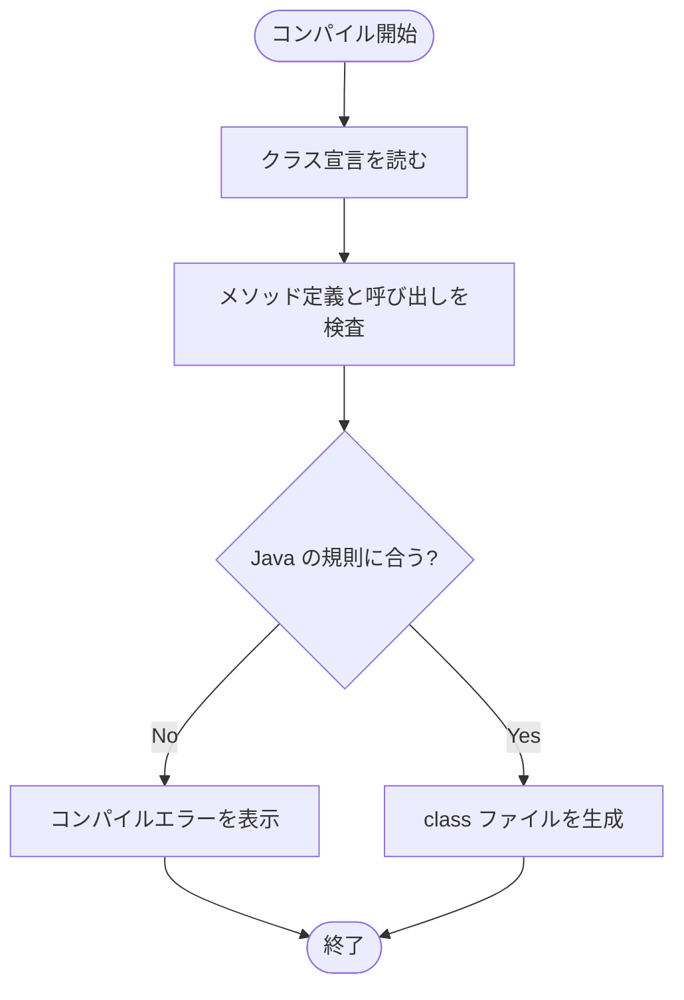

---

## Kakunin01

- 対象ファイル: `src/Kakunin01.java`
- テーマ: 識別子と予約語。

### ソースの要点

```java
private static void 12Test() { ... }
private static void static() { ... }
private static void Test#() { ... }
```

### フローチャート

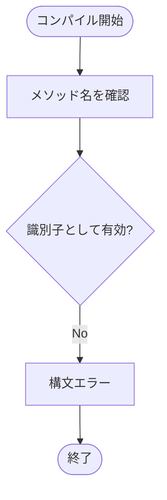

### トレース表

| ステップ | メソッド名 | 判定 | 結果 |
|---|---|---|---|
| 1 | `12Test` | 数字始まり | エラー |
| 2 | `static` / `class` / `native` | 予約語 | エラー |
| 3 | `Test#` | `#` は識別子に使えない | エラー |

### 確認ポイント

メソッド名には、Java の識別子として使える文字列だけを指定できます。

---

## Test0818

- 対象ファイル: `src/Test0818.java`
- テーマ: 仮引数と実引数の個数。

### ソースの要点

```java
static void foo(short s) { ... }
foo();
```

### フローチャート

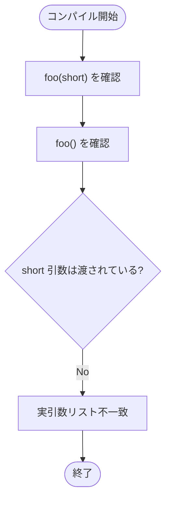

### トレース表

| ステップ | 呼び出し | 必要な引数 | 結果 |
|---|---|---|---|
| 1 | `foo(short)` | `short` 1 個 | 定義は有効 |
| 2 | `foo()` | 0 個 | 個数が合わない |
| 3 | コンパイル | `short` がない | エラー |

### 確認ポイント

デフォルトパッケージ版でも、`vol08_2/Test0818` と同じく引数不足を確認できます。

---

## vol08_2/SampleArg03

- 対象ファイル: `src/vol08_2/SampleArg03.java`
- テーマ: 引数における縮小変換。

### ソースの要点

```java
double d = 3.4;
meth(d);
```

### フローチャート

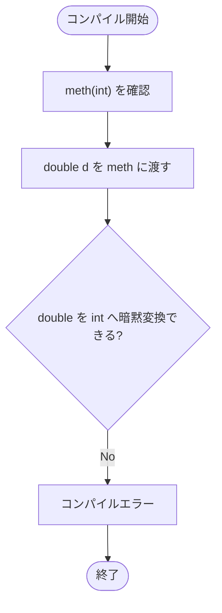

### トレース表

| ステップ | 対象 | 判定 | 結果 |
|---|---|---|---|
| 1 | `meth(int x)` | 引数は `int` | 定義は有効 |
| 2 | `meth(d)` | `d` は `double` | `int` へ暗黙変換できない |
| 3 | コンパイル | 型不一致 | エラー |

### 確認ポイント

`double` から `int` への変換は精度が失われる可能性があるため、明示的なキャストが必要です。

---

## vol08_2/SampleMethodLocal01

- 対象ファイル: `src/vol08_2/SampleMethodLocal01.java`
- テーマ: ローカル変数のスコープ。

### ソースの要点

```java
static void foo() {
    int x = 100;
}

public static void main(String[] args) {
    foo();
    System.out.println(x);
}
```

### フローチャート

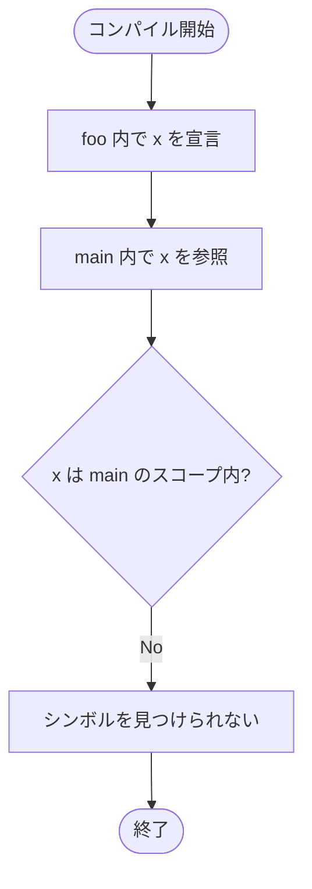

### トレース表

| ステップ | 場所 | `x` の状態 | 結果 |
|---|---|---|---|
| 1 | `foo` | 宣言される | `foo` の中だけ有効 |
| 2 | `main` | 宣言されていない | 参照できない |
| 3 | `println(x)` | スコープ外 | エラー |

### 確認ポイント

メソッド内で宣言したローカル変数は、そのメソッドの外から直接参照できません。

---

## vol08_2/SampleOverload02

- 対象ファイル: `src/vol08_2/SampleOverload02.java`
- テーマ: メソッドシグネチャ。

### ソースの要点

```java
static int add(int v, int w) { ... }
static int add(int a, int b) { ... }
```

### フローチャート

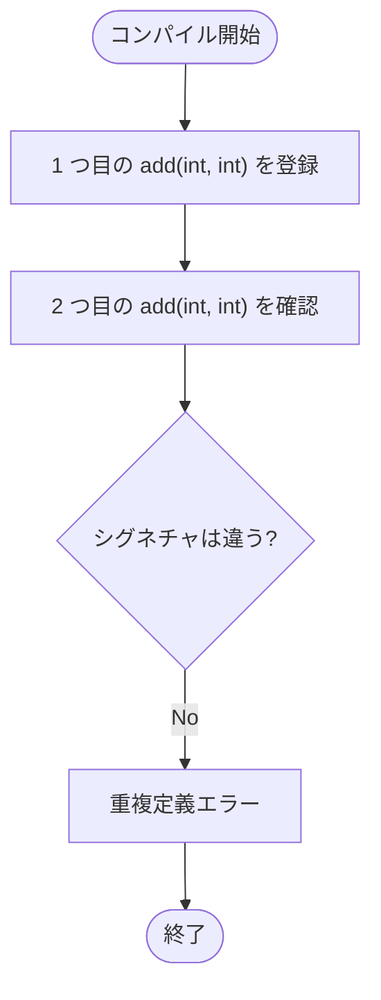

### トレース表

| ステップ | メソッド名 | 引数の型 | 判定 |
|---|---|---|---|
| 1 | `add` | `int, int` | 登録される |
| 2 | `add` | `int, int` | 既存定義と同じ |
| 3 | コンパイル | 引数名は無視 | エラー |

### 確認ポイント

シグネチャは「メソッド名 + 引数の型と順序」です。引数名だけを変えてもオーバーロードにはなりません。

---

## vol08_2/Test0807

- 対象ファイル: `src/vol08_2/Test0807.java`
- テーマ: `static` コンテキスト。

### ソースの要点

```java
int bar(int x) {
    return 2 + x;
}

static int foo() {
    int x = 5;
    x = bar(x);
    return x;
}
```

### フローチャート

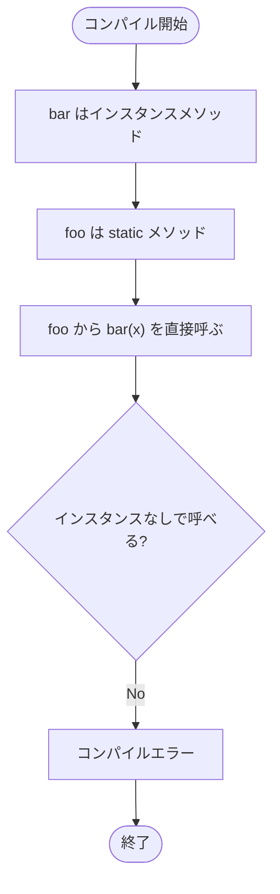

### トレース表

| ステップ | 対象 | 状態 | 結果 |
|---|---|---|---|
| 1 | `bar` | `static` なし | インスタンスメソッド |
| 2 | `foo` | `static` あり | クラスメソッド |
| 3 | `bar(x)` | インスタンス指定なし | エラー |

### 確認ポイント

`static` メソッドから `static` でないメソッドを呼ぶには、インスタンスを作って呼び出す必要があります。

---

## vol08_2/Test0810

- 対象ファイル: `src/vol08_2/Test0810.java`
- テーマ: 引数における縮小変換。

### ソースの要点

```java
static int bar(char x) { ... }
int x = 65;
x = bar(x);
```

### フローチャート

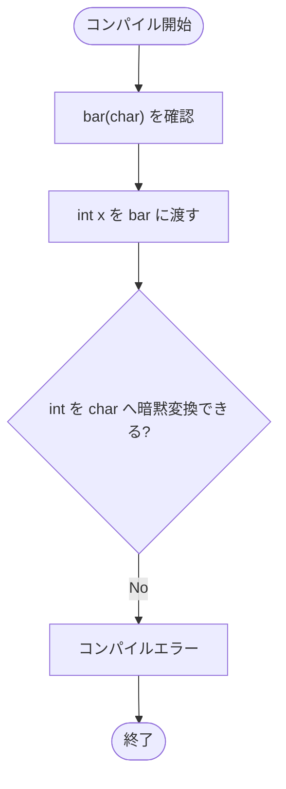

### トレース表

| ステップ | 対象 | 判定 | 結果 |
|---|---|---|---|
| 1 | `bar(char)` | 引数は `char` | 定義は有効 |
| 2 | `bar(x)` | `x` は `int` | `char` へ暗黙変換できない |
| 3 | コンパイル | 縮小変換が必要 | エラー |

### 確認ポイント

`int` を `char` に渡すには、`bar((char) x)` のように明示的なキャストが必要です。

---

## vol08_2/Test0812

- 対象ファイル: `src/vol08_2/Test0812.java`
- テーマ: `void` の使い方。

### ソースの要点

```java
static void foo(void) {
    System.out.print("A");
}
```

### フローチャート

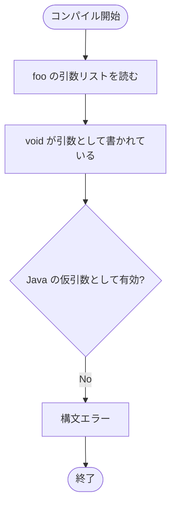

### トレース表

| ステップ | 記述 | 判定 | 結果 |
|---|---|---|---|
| 1 | `static void` | 戻り値なし | 有効 |
| 2 | `(void)` | 仮引数名がない | 無効 |
| 3 | コンパイル | `<identifier>` が必要 | エラー |

### 確認ポイント

Java で引数なしのメソッドを書く場合は、`foo()` のように空の丸括弧を使います。

---

## vol08_2/Test0818

- 対象ファイル: `src/vol08_2/Test0818.java`
- テーマ: 仮引数と実引数の個数。

### ソースの要点

```java
static void foo(short s) {
    System.out.println(s);
}

foo();
```

### フローチャート

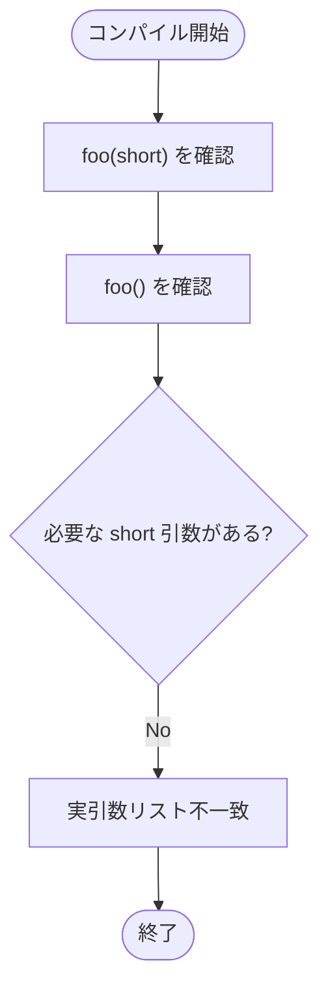

### トレース表

| ステップ | 呼び出し | 必要な引数 | 結果 |
|---|---|---|---|
| 1 | `foo(short)` | `short` 1 個 | 定義は有効 |
| 2 | `foo()` | 0 個 | 個数が合わない |
| 3 | コンパイル | `short` がない | エラー |

### 確認ポイント

メソッド呼び出しでは、仮引数に対応する実引数を渡す必要があります。

---

## vol08_3/SampleCallOverload02

- 対象ファイル: `src/vol08_3/SampleCallOverload02.java`
- テーマ: オーバーロード解決と暗黙変換。

### ソースの要点

```java
static void meth(int i, int j) { ... }
static void meth(short s) { ... }

meth(i1);
```

### フローチャート

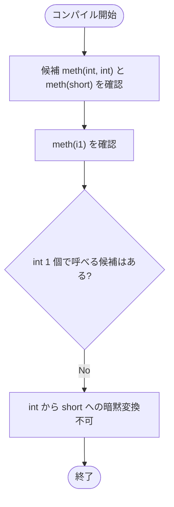

### トレース表

| ステップ | 呼び出し | 候補 | 判定 |
|---|---|---|---|
| 1 | `meth(i1, i2)` | `meth(int, int)` | 一致 |
| 2 | `meth(i1)` | `meth(short)` | `int` を `short` に縮小できない |
| 3 | コンパイル | 適用可能な候補なし | エラー |

### 確認ポイント

`short` から `int` への拡大変換はできますが、`int` から `short` への縮小変換は自動では行われません。

---

## vol08_3/SampleCallOverload03

- 対象ファイル: `src/vol08_3/SampleCallOverload03.java`
- テーマ: オーバーロード解決の曖昧さ。

### ソースの要点

```java
static void meth(short x, int y) { ... }
static void meth(int x, short y) { ... }

byte b1 = 1, b2 = 2;
meth(b1, b2);
```

### フローチャート

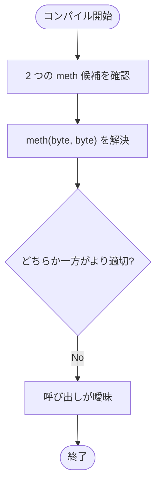

### トレース表

| ステップ | 候補 | 変換 | 判定 |
|---|---|---|---|
| 1 | `meth(short, int)` | `byte -> short`, `byte -> int` | 適用可能 |
| 2 | `meth(int, short)` | `byte -> int`, `byte -> short` | 適用可能 |
| 3 | 呼び出し | 優先候補を決められない | エラー |

### 確認ポイント

複数のオーバーロード候補が同程度に一致すると、コンパイラは呼び出し先を決められません。

---

## vol08_3/SampleStaticMethod01

- 対象ファイル: `src/vol08_3/SampleStaticMethod01.java`
- テーマ: `static` メソッドとインスタンスメソッド。

### ソースの要点

```java
void foo() {
}

public static void main(String[] args) {
    foo();
}
```

### フローチャート

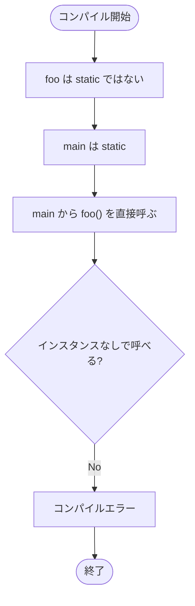

### トレース表

| ステップ | 対象 | 状態 | 結果 |
|---|---|---|---|
| 1 | `foo()` | インスタンスメソッド | 定義は有効 |
| 2 | `main` | `static` | クラスから起動 |
| 3 | `foo()` 呼び出し | インスタンスなし | エラー |

### 確認ポイント

`static` でないメソッドは、`new SampleStaticMethod01().foo()` のようにインスタンス経由で呼びます。

---

## vol08_3/SampleVarArg02

- 対象ファイル: `src/vol08_3/SampleVarArg02.java`
- テーマ: 通常引数と可変長引数の組み合わせ。

### ソースの要点

```java
static void foo(double d, int... x) { ... }

foo();
foo(x);
```

### フローチャート

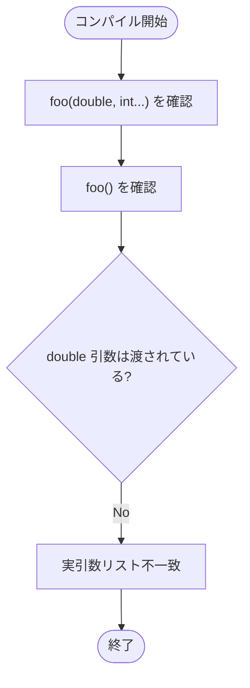

### トレース表

| ステップ | 呼び出し | `double d` | `int... x` | 結果 |
|---|---|---|---|---|
| 1 | `foo()` | なし | 0 個扱い可能 | `d` がないためエラー |
| 2 | `foo(x)` | `int` から `double` へ拡大可能 | 0 個 | この行単独なら可 |
| 3 | コンパイル | 最初のエラーで停止 | - | エラー |

### 確認ポイント

可変長引数は省略できますが、その前にある通常引数は省略できません。

---

## vol08_3/SampleVarArgOverride01

- 対象ファイル: `src/vol08_3/SampleVarArgOverride01.java`
- テーマ: 可変長引数のシグネチャ。

### ソースの要点

```java
static void foo(int... i) { ... }
static void foo(int... j) { ... }
```

### フローチャート

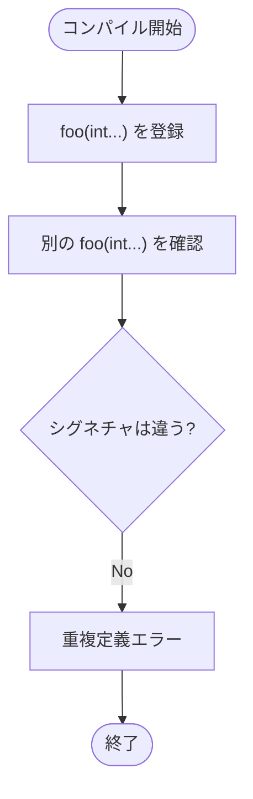

### トレース表

| ステップ | メソッド | シグネチャ | 結果 |
|---|---|---|---|
| 1 | 1 つ目 | `foo(int...)` | 登録 |
| 2 | 2 つ目 | `foo(int...)` | 同じ |
| 3 | コンパイル | 引数名は無関係 | エラー |

### 確認ポイント

可変長引数でも、引数名だけを変えた定義は重複になります。

---

## vol08_3/SampleVarArgOverride02

- 対象ファイル: `src/vol08_3/SampleVarArgOverride02.java`
- テーマ: 可変長引数と配列。

### ソースの要点

```java
static void foo(int... i) { ... }
static void foo(int[] j) { ... }
```

### フローチャート

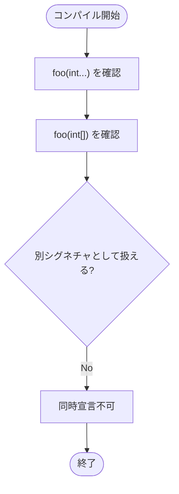

### トレース表

| ステップ | 記述 | コンパイル上の扱い | 結果 |
|---|---|---|---|
| 1 | `int...` | `int[]` として扱う | 登録 |
| 2 | `int[]` | 同じ型 | 重複 |
| 3 | コンパイル | 両方は宣言不可 | エラー |

### 確認ポイント

可変長引数は、メソッド内部やシグネチャ上では配列に近い扱いになります。

---

## vol08_3/Test10

- 対象ファイル: `src/vol08_3/Test10.java`
- テーマ: 引数名とシグネチャ。

### ソースの要点

```java
static void add(int x, int y) { ... }
static void add(int i, int j) { ... }
```

### フローチャート

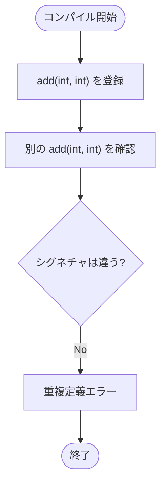

### トレース表

| ステップ | 定義 | シグネチャ | 結果 |
|---|---|---|---|
| 1 | `add(int x, int y)` | `add(int, int)` | 登録 |
| 2 | `add(int i, int j)` | `add(int, int)` | 重複 |
| 3 | コンパイル | 引数名は無関係 | エラー |

### 確認ポイント

`Test3` と同様に、引数名だけではメソッドを区別できません。

---

## vol08_3/Test13

- 対象ファイル: `src/vol08_3/Test13.java`
- テーマ: 配列型の変換。

### ソースの要点

```java
static void foo(int[] x) { ... }
static void foo(byte[] b) { ... }

short[] s = {10, 20, 30};
foo(s);
```

### フローチャート


### トレース表

| ステップ | 実引数 | 候補 | 判定 |
|---|---|---|---|
| 1 | `short[]` | `int[]` | 配列型が違う |
| 2 | `short[]` | `byte[]` | 配列型が違う |
| 3 | `foo(s)` | 適用可能な候補なし | エラー |

### 確認ポイント

基本型の拡大変換が可能でも、配列型全体には同じ変換は適用されません。

---

## vol08_3/Test3

- 対象ファイル: `src/vol08_3/Test3.java`
- テーマ: 引数名とオーバーロード。

### ソースの要点

```java
static void foo(int x, int y) { ... }
static void foo(int a, int b) { ... }
```

### フローチャート

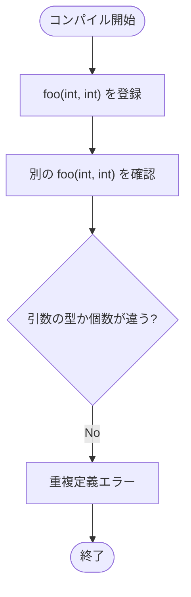

### トレース表

| ステップ | 定義 | シグネチャ | 結果 |
|---|---|---|---|
| 1 | `foo(int x, int y)` | `foo(int, int)` | 登録 |
| 2 | `foo(int a, int b)` | `foo(int, int)` | 重複 |
| 3 | コンパイル | 同じシグネチャ | エラー |

### 確認ポイント

引数名は、オーバーロードを区別する材料にはなりません。

---

## vol08_3/Test5

- 対象ファイル: `src/vol08_3/Test5.java`
- テーマ: 配列型の変換。

### ソースの要点

```java
static void foo(int[] x) { ... }
static void foo(float[] x) { ... }

byte[] x = new byte[10];
foo(x);
```

### フローチャート

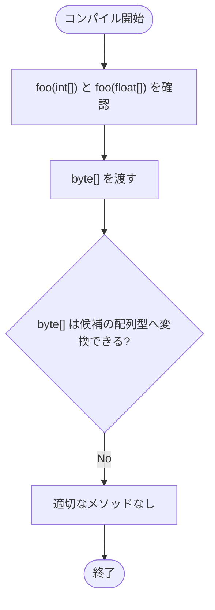

### トレース表

| ステップ | 実引数 | 候補 | 判定 |
|---|---|---|---|
| 1 | `byte[]` | `int[]` | 配列型が違う |
| 2 | `byte[]` | `float[]` | 配列型が違う |
| 3 | `foo(x)` | 適用可能な候補なし | エラー |

### 確認ポイント

`byte` から `int` への拡大変換が可能でも、`byte[]` から `int[]` への配列変換はできません。

---

## vol08_3/Test9

- 対象ファイル: `src/vol08_3/Test9.java`
- テーマ: 戻り値型、修飾子、シグネチャ。

### ソースの要点

```java
int method(int i) { ... }
double method(int x) { ... }
public int method(int y) { ... }
```

### フローチャート

```mermaid
flowchart TD
    A([コンパイル開始]) --> B["method(int) を登録"]
    B --> C["double method(int) を確認"]
    C --> D{"戻り値型だけ違えばよい?"}
    D -- No --> E["重複定義エラー"]
    E --> F["public int method(int) も重複"]
    F --> G([終了])
```

### トレース表

| ステップ | 定義 | 違い | 結果 |
|---|---|---|---|
| 1 | `int method(int i)` | 基準 | 登録 |
| 2 | `double method(int x)` | 戻り値型だけ違う | 重複 |
| 3 | `public int method(int y)` | 修飾子と引数名だけ違う | 重複 |
| 4 | `method(double)` / `method()` / `method(int, int)` | 引数が違う | 定義可能 |

### 確認ポイント

戻り値型やアクセス修飾子は、オーバーロードの判定に使われません。

---

## vol08_3/TestVarArg02

- 対象ファイル: `src/vol08_3/TestVarArg02.java`
- テーマ: 通常引数と可変長引数。

### ソースの要点

```java
static void foo(int x, int... y) { ... }

foo();
foo(1);
```

### フローチャート

```mermaid
flowchart TD
    A([コンパイル開始]) --> B["foo(int, int...) を確認"]
    B --> C["foo() を確認"]
    C --> D{"先頭の int 引数は渡されている?"}
    D -- No --> E["実引数リスト不一致"]
    E --> F([終了])
```

### トレース表

| ステップ | 呼び出し | `int x` | `int... y` | 結果 |
|---|---|---|---|---|
| 1 | `foo()` | なし | 0 個扱い可能 | `x` がないためエラー |
| 2 | `foo(1)` | あり | 0 個 | この行単独なら可 |
| 3 | コンパイル | 最初のエラーで停止 | - | エラー |

### 確認ポイント

可変長引数の前にある通常引数は、省略できません。

---

## vol08_3/TestVarArg03

- 対象ファイル: `src/vol08_3/TestVarArg03.java`
- テーマ: 可変長引数の個数制限。

### ソースの要点

```java
static void foo(int... x, int... y) {
    System.out.print("A");
}
```

### フローチャート

```mermaid
flowchart TD
    A([コンパイル開始]) --> B["1 つ目の int... x を確認"]
    B --> C["2 つ目の int... y を確認"]
    C --> D{"可変長引数は最後で 1 つだけ?"}
    D -- No --> E["コンパイルエラー"]
    E --> F([終了])
```

### トレース表

| ステップ | 記述 | 判定 | 結果 |
|---|---|---|---|
| 1 | `int... x` | 可変長引数 | ここで最後である必要がある |
| 2 | `int... y` | さらに引数が続く | 無効 |
| 3 | コンパイル | 可変長引数が複数 | エラー |

### 確認ポイント

可変長引数は、1 つのメソッドにつき 1 つだけ定義できます。

---

## vol08_3/TestVarArg04

- 対象ファイル: `src/vol08_3/TestVarArg04.java`
- テーマ: 可変長引数の位置。

### ソースの要点

```java
static void foo(int... x, int y) {
    System.out.print("A");
}
```

### フローチャート

```mermaid
flowchart TD
    A([コンパイル開始]) --> B["int... x を確認"]
    B --> C["後ろに int y が続く"]
    C --> D{"可変長引数は最後?"}
    D -- No --> E["コンパイルエラー"]
    E --> F([終了])
```

### トレース表

| ステップ | 記述 | 判定 | 結果 |
|---|---|---|---|
| 1 | `int... x` | 可変長引数 | 後ろに引数を置けない |
| 2 | `int y` | 通常引数 | 位置が無効 |
| 3 | コンパイル | 可変長引数が最後ではない | エラー |

### 確認ポイント

可変長引数は、必ず引数リストの最後に置きます。

---

## vol08_3/TestVarArg09

- 対象ファイル: `src/vol08_3/TestVarArg09.java`
- テーマ: 可変長引数と配列。

### ソースの要点

```java
static void foo(int[] x) { ... }
static void foo(int... x) { ... }
```

### フローチャート

```mermaid
flowchart TD
    A([コンパイル開始]) --> B["foo(int[]) を確認"]
    B --> C["foo(int...) を確認"]
    C --> D{"別シグネチャとして扱える?"}
    D -- No --> E["同時宣言不可"]
    E --> F([終了])
```

### トレース表

| ステップ | 記述 | コンパイル上の扱い | 結果 |
|---|---|---|---|
| 1 | `int[]` | 配列引数 | 登録 |
| 2 | `int...` | `int[]` と同じ扱い | 重複 |
| 3 | コンパイル | 両方は宣言不可 | エラー |

### 確認ポイント

`SampleVarArgOverride02` と同様に、`int[]` と `int...` は同時に宣言できません。
